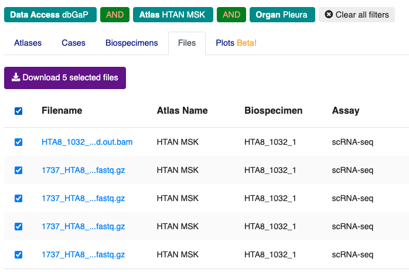
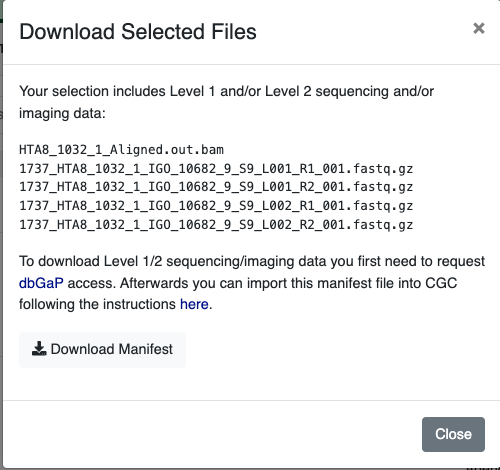

# Accessing Sequence Data via NCI's Cancer Data Service (CDS)

!!!
**NOTE**: dbGaP approval for HTAN study [phs002371](https://www.ncbi.nlm.nih.gov/projects/gap/cgi-bin/study.cgi?study_id=phs002371.v3.p1) is required in order to access HTAN lower-level genomics data, such as RNAseq FASTQ and BAM files.
!!!

The [CDS Portal](https://dataservice.datacommons.cancer.gov/), within NCI's Cancer Research Data Commons (CRDC), provides an interface to filter and select data from a variety of NCI programs, including controlled-access, primary sequence data from the Human Tumor Atlas Network (HTAN). 

# DRS Manifest Files

To access data via CDS, first generate a CDS Data Repository Service (DRS) manifest containing the files you would like to obtain. DRS manifests are CSV files and require at minimum the **name** and **drs_uri** of each file of interest. For HTAN data, DRS manifests can be generated in one of three ways: 

1. CDS Portal
2. HTAN Data Portal
3. Google BigQuery

## 1. Generating a Manifest File from the CDS Portal

In order to access HTAN imaging data within the [CDS Portal](https://dataservice.datacommons.cancer.gov/), navigate to the portal in a web browser and click on the **Explore CDS Data** button on the landing page.

&nbsp;

On the Data Explorer page, expand the STUDY section on the left sidebar, scroll down, and check the box next to **Human Tumor Atlas (HTAN) primary sequence data**.

&nbsp;

This action will change the summary panel to reflect selecting HTAN data only.

&nbsp;

Scroll down, or click on the **Collapse View** tab on the upper right just below the query summary line in order to see the tabulated view of all of the participants, samples or files in HTAN.

&nbsp;

Click on the **Add All Files** button, or select the check boxes next to all Participants, Samples or Files for a subselection and then click on the **Add Selected** button.  This action will update your cart icon in the upper right corner.

&nbsp;

Clicking on the cart icon, will bring up a list of the selected files.  Click on the **Download Manifest** button in the upper right to download a CSV-formated (Excel compatible) file of this file list.

&nbsp;

## 2. Generating a Manifest File from the HTAN Data Portal

From the [HTAN Data Portal](https://humantumoratlas.org/), click **CDS/SB-CGC (dbGaP)** under the **Data Access** filter. 

Navigate to the **Files** tab, check the box next to **Filename** in upper left, and then click **Download selected files**. 

Click **Download Manifest**, which will download a local file called `cds_manifest.csv`. 

## 3. Generating a Manifest File from Google BigQuery
HTAN metadata and a mapping of HTAN Data File IDs to CDS DRS URIs are available as Google BigQuery tables via the Institute for Systems Biology Cancer Gateway in the Cloud (ISB-CGC) (see [Google BigQuery](https://docs.humantumoratlas.org/open_access/biq_query/)). These tables can be used to subset data to a cohort of interest, and obtain DRS URIs of files to access. 

For a step-by-step guide on how to generate a DRS manifest file using Google BigQuery, please see the Python notebook [Creating_CDS_Data_Import_Manifests_Using_BQ.ipynb](https://github.com/isb-cgc/Community-Notebooks/blob/master/HTAN/Python%20Notebooks/Creating_CDS_Data_Import_Manifests_Using_BQ.ipynb).

# Accessing Data
Once you have your manifest, follow the instructions on SB-CGC's [Import from a DRS server](https://docs.cancergenomicscloud.org/docs/import-from-a-drs-server#import-from-a-manifest-file) documentation page to import data from a manifest file.