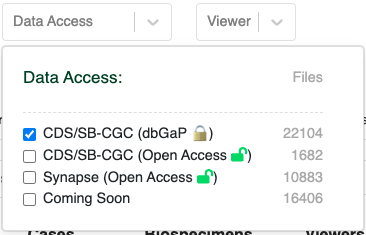

# Accessing Sequence Data via NCI's Cancer Data Service (CDS)

!!!
**NOTE**: dbGaP approval for HTAN study [phs002371](https://www.ncbi.nlm.nih.gov/projects/gap/cgi-bin/study.cgi?study_id=phs002371.v3.p1) is required in order to access HTAN lower-level genomics data, such as RNAseq FASTQ and BAM files.
!!!

The [CDS Portal](https://dataservice.datacommons.cancer.gov/), within NCI's Cancer Research Data Commons (CRDC), provides an interface to filter and select data from a variety of NCI programs, including controlled-access, primary sequence data from the Human Tumor Atlas Network (HTAN). This page provides directions for importing sequencing data from CDS to the [Cancer Genomics Commons (CGC)](https://cancergenomicscloud.org/).

The directions for accessing sequencing data on CDS are similar to those for [Level 2 Imaging Data Access](../open_access/cds_imaging.md), including Direct Export from CDS to CGC and importing data using a Data Repository Service (DRS) Manifest.  Please follow the [Level 2 Imaging Data Access](../open_access/cds_imaging.md) directions to access sequencing data, noting the following changes:

1. For Direct Export or Generating a DRS Manifest from CDS, choose **Human Tumor Atlas (HTAN) primary sequence data** on the STUDY section of the left hand sidebar instead of **Human Tumor Atlas (HTAN) imaging data**.

&nbsp;

2. To generate a DRS Manifest from the 
[HTAN Data Portal](https://humantumoratlas.org/), click **CDS/SB-CGC (dbGaP)** under the **Data Access** filter instead of **CDS/SB-CGC (Open Access)**. 

