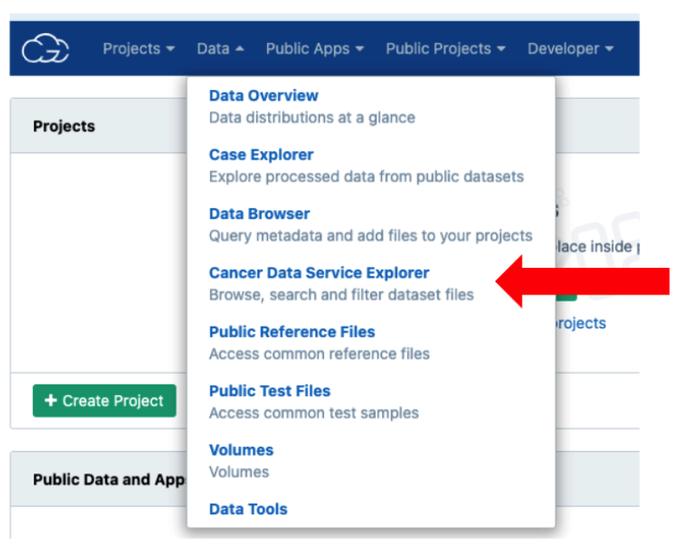
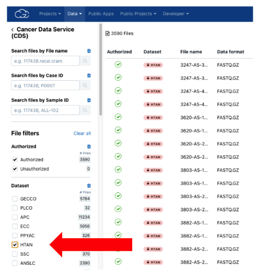

# SB-CGC Cancer Data Service (CDS) Explorer

**NOTE**: dbGaP approval for HTAN study [phs002371](https://www.ncbi.nlm.nih.gov/projects/gap/cgi-bin/study.cgi?study_id=phs002371.v3.p1) is required in order to access HTAN lower-level genomics data, such as RNAseq FASTQ and BAM files.

Once your dbGaP application has been approved, you can access HTAN data via the **Cancer Data Service browser** within the Seven Bridges Cancer Genomics Cloud. To do so, head to [Seven Bridges Cancer Genomics Cloud](https://www.cancergenomicscloud.org/), and log in with your ERA Commons credentials.

Once logged in, navigate to the top navigation bar, and select **Data > Cancer Data Service Explorer**.

You can then use the faceted search interface in the left column to filter for HTAN files.

!!! Using Seven Bridges Cancer Genomics Cloud
Using Seven Bridges Cancer Genomics Cloud is beyond the scope of this manual. To get started, please refer to the [extensive online documentation](https://docs.cancergenomicscloud.org/docs) and [support options](https://www.cancergenomicscloud.org/officehours).
!!!
