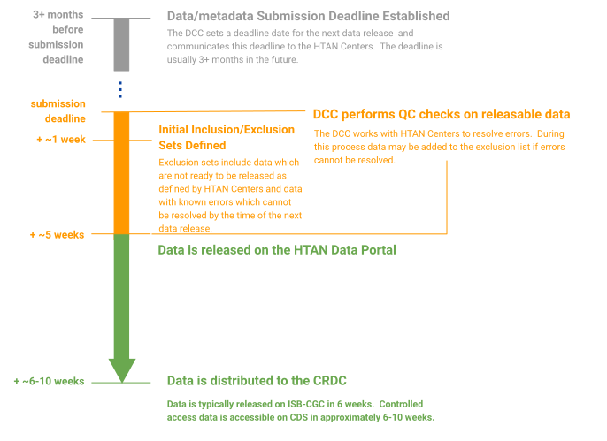

# Data Release

The Data Coordinating Center (DCC) prepares major data releases every 4-6 months. HTAN Centers are notified of the data submission deadline for an upcoming data release. After that deadline, the pre-release process involves a number of data processing and metadata verification steps. Data is released via the HTAN Data Portal, and then disseminated to various Cancer Data Research Commons (CRDC) nodes including Cancer Data Service (CDS) and the Institute for Systems Biology Cancer Gateway in the Cloud (ISB-CGC) to enable download of controlled-access data and long-term cloud access

Please see [HTAN Data Release Process](https://docs.google.com/document/d/10sv22HgtWAKt1wlV9eGbbI-itWejASVqDy42esS43DQ/edit?usp=drive_link) for more information regarding the data release process.

