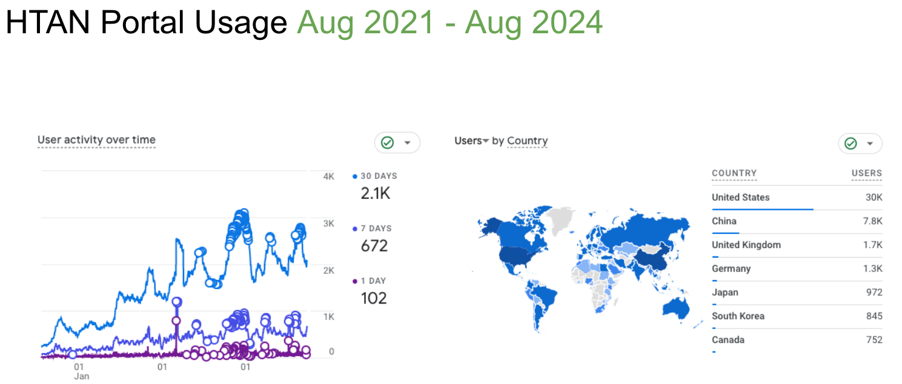
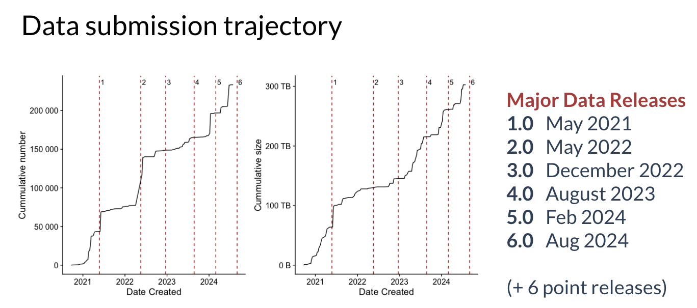

# HTAN Data Usage Analytics

The HTAN portal is used by thousands of people each month all over the world:

## Data Submission Trajectory

The HTAN Data Coordination Center (DCC) has been working with the HTAN Centers to collect and process data. The following figure shows the number of data submissions to the DCC over time:

