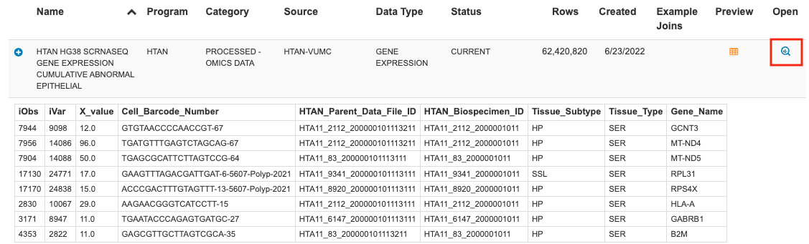

# Google BigQuery

[Google BigQuery](https://cloud.google.com/bigquery) is a massively-parallel analytics engine ideal for working with tabular data. Through our collaboration with the [Institute for Systems Biology Cancer Gateway in the Cloud (ISB-CGC)](https://isb-cgc.appspot.com/), open-access HTAN BigQuery tables are now available, and updated with each major HTAN release.

HTAN BigQuery tables can be accessed through the [ISB-CGC Table Search UI](https://isb-cgc.appspot.com/) and via the HTAN Data Portal.

For complete documentation regarding ISB-CGC BigQuery functionality, check out their [online documentation](https://isb-cancer-genomics-cloud.readthedocs.io/en/latest/sections/BigQueryTableSearchUI.html#).

!!! Google Accounts
You must have a Google account to access Google Big Query.

[Google Cloud Platform’s free tier](https://cloud.google.com/free) allows users to access many common Google Cloud resources, including BigQuery free of charge and query up to 1 TB of data per month for free.

!!!

## Accessing Metadata tables

HTAN metadata is organized by data type and level (see [HTAN Data Model](../data_model/overview.md)), with each BigQuery table containing data from all HTAN Centers combined.

Metadata tables can be accessed from the **Atlases** tab of the HTAN Data Portal. Click the icon under the **Metadata** column and scroll down to the **Google BigQuery** link at the bottom of the popup window.

This link will take you to the ISB-CGC Table Search UI filtered to HTAN tables. Browse the table listing to find your table of interest, and **click the magnifying glass icon under Open** to launch the table in the BigQuery console.

Alternatively, you can start at the [ISB-CGC Table Search UI](https://isb-cgc.appspot.com/) and select **Launch** under BigQuery Table Search.

Then filter for HTAN tables by selecting **HTAN** from the Program dropdown.

### Example Query

As an example, this simple query tabulates the overall distribution of gender in HTAN, as reported in the HTAN Clinical Demographics BigQuery table isb-cgc-bq.HTAN_versioned.clinical_tier1_demographics_r2. For complete details on running queries and the Biq Query syntax, refer to the [Google BiqQuery Documentation](https://cloud.google.com/bigquery/docs).

## Accessing Single Cell Tables

We currently host multiple single cell BigQuery tables via ISB-CGC. These tables are derived from level 4 H5AD AnnData files submitted by HTAN centers.

When a BigQuery table is available for a given file, a link will be visible in the **View** Column of the HTAN Data Portal.

This link will take you to the ISB-CGC Table Search UI listing for the selected single cell file. Click the magnifying glass icon under **Open** to launch the table in the BigQuery console.

### Example Query

In this example, we query the single cell RNA seq-derived gene expression data for non-epithelial cells in [colon polyps published by the Vanderbilt HTAN center](<https://www.cell.com/cell/fulltext/S0092-8674(21)01381-7>). We filter cells to those expressing the leukocyte marker CD45, coded by gene PTPRC, and enumerate cells by their identified phenotype (B = B cell, T = T cell, END = endothelial, FIB = fibroblast, MAS = mast cell, MYE = myeloid, PLA = plasma).

## Accessing Cell Spatial Data
We also host a number of tables that contain information on cellular locations and the estimated expression of key marker protein based multiplexed imaging followed by cell segmentation. These tables are available on ISB-CGC and are derived from Imaging Level 4 t-CyCif files submitted by HTAN centers.

## BigQuery Notebooks

ISB-CGC hosts a public repository of community-generated computational notebooks. The HTAN DCC has contributed a number of R and Python notebooks, illustrating how to query, perform analyses, and generate results using the publicly available HTAN BigQuery tables.

To access HTAN R and Python notebooks, visit the 'HTAN Notebooks' page of the [Institute for Systems Biology Cancer Gateway in the Cloud (ISB-CGC) documentation](https://isb-cancer-genomics-cloud.readthedocs.io/en/latest/sections/HTANNotebooks.html)

