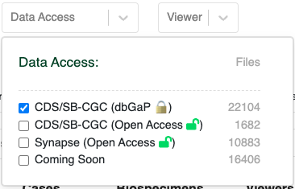

# Accessing CRDC Data in SB-CGC

[Seven Bridges Cancer Genomics Cloud (SB-CGC)](https://www.cancergenomicscloud.org/) is a cloud platform for the analysis and storage of large cancer datasets. There are two mechanisms for transferring HTAN data from the NCI's Cancer Research Data Commons (CRDC) to SB-CGC:

1. Direct export from the CDRC General Commons (GC) [Portal](https://general.datacommons.cancer.gov/#/data).
2. Export via a Data Repository Service (DRS) Manifest.

!!! Access Requirements
**SB-CGC** Data access via Seven Bridges Cancer Genomics Cloud (SB-CGC) requires a CGC account [[register here](https://docs.cancergenomicscloud.org/docs/sign-up-for-the-cgc)]. For further information on using SB-CGC resources including programmatic access options, you can explore their [online documentation](https://docs.cancergenomicscloud.org/docs).\
**Access-controlled data** To download access-controlled files, you must first complete a [dbGAP request](db_gap.md).
!!!

HTAN Data in CRDC includes:
1. Open Access Level 2 Imaging Files; and
2. Access-controlled Sequencing Data (e.g. fastq and BAM files)

## Imaging Files

### Direct Export 
In order to access HTAN imaging data within CRDC, navigate to the [GC Portal](https://general.datacommons.cancer.gov/#/data) in a web browser.

On the Data Explorer page, expand the STUDY section on the left sidebar, scroll down, and check the box next to **Human Tumor Atlas (HTAN) imaging data**.

This action will change the summary panel to reflect selecting HTAN data only.

Scroll down, or click on the **Collapse View** tab on the upper right just below the query summary line in order to see the tabulated view of all of the participants, samples or files in HTAN.

Click on the **Add All Files** button, or select the check boxes next to all Participants, Samples or Files for a subselection and then click on the **Add Selected** button.  This action will update your cart icon in the upper right corner.

Clicking on the cart icon, will bring up a list of the selected files. Expand the **Available Export Options** drop down menu and select **Export to Cancer Genomics Cloud**.

!!! 
Note: The **Download Manifest** can also be chosen instead of **Export to Cancer Genomics Cloud**.  Please see [DRS Manifest Files](#drs-manifest-files) for more information.
!!!

Follow the prompts to log in to CGC.  Then select a Destination project, check the box to agree to CGC terms and import the data.

### DRS Manifest Files

DRS manifests are CSV files which list the files you would like to obtain. They require at minimum the **name** and **drs_uri** of each file of interest. For data transfer using a DRS Manifest, there are two main steps:

1. [Generate the DRS Manifest](#1-generate-the-drs-manifest) 
2. [Import the data to CGC](#2-import-the-data-into-cgc)

#### 1. Generate the DRS Manifest 

For HTAN data, DRS Manifests can be generated from three different locations: 

* General Commons (GC) Portal
* HTAN Data Portal
* Google BigQuery

##### Generating a DRS Manifest from the GC Portal

Follow the directions for [Direct Export](#direct-export) of files from GC.  In the cart, click on the **Download Manifest** button on the upper right to download a CSV-formated (Excel compatible) copy of your file list.

##### Generating a DRS Manifest from the HTAN Data Portal

!!!
Cancer Data Services (CDS) has changed its name to General Commons (GC). The HTAN Portal will be updated soon to reflect this change.
!!!

From the [HTAN Data Portal](https://humantumoratlas.org/), click **CDS/SB-CGC (Open Access)** under the **Data Access** filter. 

Navigate to the **Files** tab, check the box next to **Filename** in upper left, and then click **Download selected files**. 

Click **Download Manifest**, which will download a local file called `cds_manifest.csv`. 

##### Generating a DRS Manifest from Google BigQuery
!!!
Cancer Data Services (CDS) has changed its name to General Commons (GC). The Big Query notebook referenced below will be updated soon to reflect this change.
!!!

HTAN metadata and a mapping of HTAN Data File IDs to GC DRS URIs are available as Google BigQuery tables via the Institute for Systems Biology Cancer Gateway in the Cloud (ISB-CGC) (see [Google BigQuery](https://docs.humantumoratlas.org/data_access/biq_query/)). These tables can be used to subset data to a cohort of interest, and obtain DRS URIs of files to access. 

For a step-by-step guide on how to generate a DRS manifest file using Google BigQuery, please see the Python notebook [Creating_General_Commons_Data_Import_Manifests_Using_BQ.ipynb](https://github.com/isb-cgc/Community-Notebooks/blob/master/HTAN/Python%20Notebooks/Creating_General_Commons_Data_Import_Manifests_Using_BQ.ipynb).

#### 2. Import the data into CGC
Once you have your manifest, follow the instructions on SB-CGC's [Import from a DRS server](https://docs.cancergenomicscloud.org/docs/import-from-a-drs-server#import-from-a-manifest-file) documentation page to import data from a manifest file.

## Sequencing Data
The [General Commons (GC) Portal](https://general.datacommons.cancer.gov/#/data), within NCI's Cancer Research Data Commons (CRDC), provides an interface to filter and select data from a variety of NCI programs, including controlled-access, primary sequence data from the Human Tumor Atlas Network (HTAN).

The directions for accessing sequencing data on GC are similar to those for [Level 2 Imaging Data Access](#imaging-files), including Direct Export from GC to CGC and importing data using a Data Repository Service (DRS) Manifest.  Please follow the [Level 2 Imaging Data Access](#imaging-files) directions to access sequencing data, noting the following changes:

1. For Direct Export or Generating a DRS Manifest from GC, choose **Human Tumor Atlas (HTAN) primary sequence data** on the STUDY section of the left hand sidebar instead of **Human Tumor Atlas (HTAN) imaging data**.

&nbsp;

2. To generate a DRS Manifest from the 
[HTAN Data Portal](https://humantumoratlas.org/), click **CDS/SB-CGC (dbGaP)** under the **Data Access** filter instead of **CDS/SB-CGC (Open Access)**. 

!!!
Cancer Data Services (CDS) has changed its name to General Commons (GC). The HTAN Portal will be updated soon to reflect this change.
!!!

