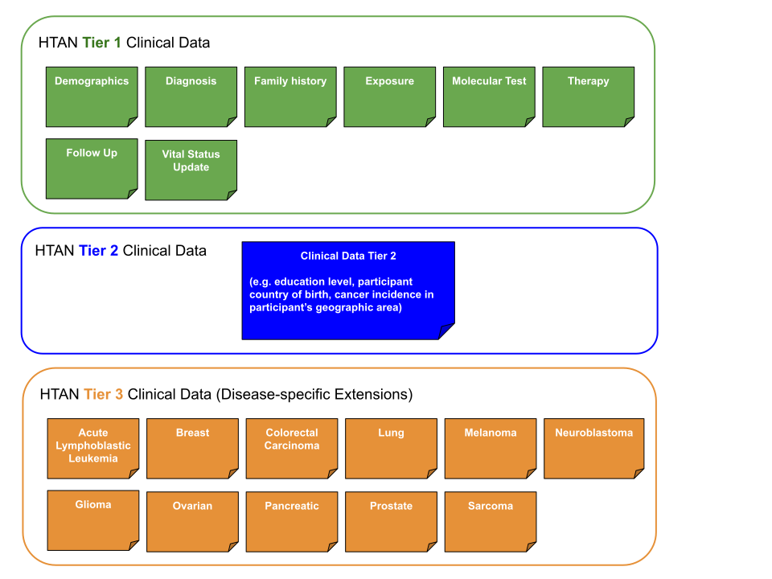

# Metadata, Clinical Metadata Tiers and Data Levels

The [Data Standards](https://humantumoratlas.org/standards) pages of the HTAN Data Portal provide a detailed overview of the HTAN Data Model. A basic description of how the HTAN Data Model is organized is provided on this page. 

## Metadata
Metadata means data *about* data.  Metadata enables both data searchability and interpretability. For HTAN, this includes sample and case identifiers, patient information (e.g. demographics), biospecimen information (e.g. tumor type), and assay-specific information (e.g. experiment protocol, assay reagents or assay technology). 

Metadata can be further divided into broad categories:
1. clinical metadata;
2. biospecimen metadata; and
3. assay metadata.

Clinical Metadata is divided into Tiers as described in [Clinical Metadata Tiers](#clinical-metadata-tiers).  Assay Metadata (and the associated Assay Data Files) are divided into [Data Levels](#assay-data-levels).

## Clinical Metadata Tiers
Clinical metadata is organized into tiers. The structure of these tiers differs in Phase 1 and Phase 2 of HTAN. In Phase 1 there were three clinical data tiers.  In Phase 2, there are two. For both phases, Tier 1 represents clinical data which is generally common to all studies and Atlases. Higher tiers are extensions to Tier 1, some of which are cancer or study-specific.  

### Phase 2 Clinical Metadata Tiers
In HTAN Phase 2, there are only two clinical metadata tiers. Tier 1 metadata is divided into multiple categories, including Demographics, Diagosis, Family History, Exposure, Molecular Test, Therapy, Follow Up and Vital Status. Tier 2 contains any cancer or study-specific clinical information which is not represented in Tier 1. Tier 2 is a flexible comma-separated value (csv) file. The only required attribute is HTAN Participant ID. All other attributes (columns headers) are determined by the submitting Center. Figure 2 provides an general representation of the model. 

### Phase 1 Clinical Metadata Tiers
In HTAN Phase 1, Tier 1 clinical metadata was based on the NCI's Genomic Data Commons (GDC) clinical data model.  Similar to HTAN Phase 2, Tier 1 metadata was divided into multiple categories, including Demographics, Diagosis, Family History, Exposure, Molecular Test, Therapy, Follow Up and Vital Status Update. However, the attributes, valid values and requirements differ between Phase 1 and Phase 2 for each of these Tier 1 clinical metadata categories.  Phase 1 Tiers two and three are disease-agnostic (Tier 2) and disease-specific (Tier 3) extensions to the GDC model. These tiers are shown in figure 3 and are described more on the [Clinical Data Page](https://humantumoratlas.org/standard/clinical). 

## Assay Data Levels
The HTAN Data Model divides assay data into levels. Each assay type has levels progressing from raw data to more processed data.  This is illustrated in Figure 4 for sequencing data.  Please see each assay's page within [Data Standards](https://humantumoratlas.org/standards) for more information.

For Sequencing data, the HTAN Model Data levels help distinguish data as [open access versus access-controlled](../data_access/introduction.md).  For example, level 1 and 2 sequencing data are access-controlled data.     

