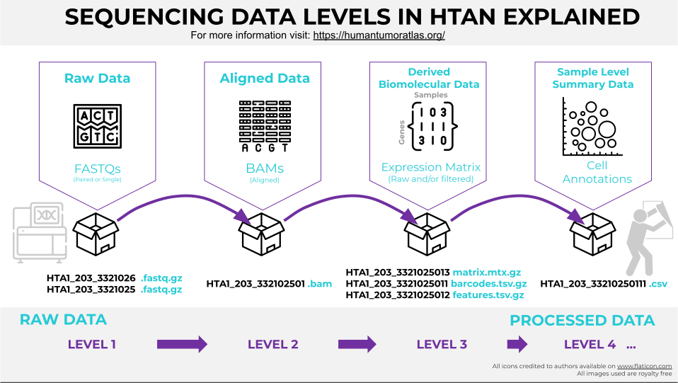

# File Standards

The HTAN Data Model includes requirements for Assay Files. These include:
1. How Data Files are organized ([Assay Data Levels](#assay-data-levels));
2. What File Formats are accepted ([Accepted File Formats](#accepted-file-formats)); and
3. Specific Assay or Assay Model Requirements ([Specific Requirements](#specific-assayassay-module-requirements)).

## Assay Data Levels
In both the HTAN Phase 1 and Phase 2 Data Models, assay data is divided into levels. Each assay type has levels progressing from raw data to more processed data.  (See Figure 1. ) For Sequencing data, the HTAN Model Data levels help distinguish data as [open access versus access-controlled](../data_access/introduction.md).  For example, level 1 and 2 sequencing data are access-controlled data. 

==- Figure 1. HTAN Sequencing Data levels (Expand Panel to see Figure.)

===

==- Phase 2 Assay Data Levels
The Phase 2 Data Model is still being developed. This page will be updated as these updates occur. The following are the current supported assays, organized alphabetically.
===

==- Phase 1 Assay Data Levels
## Phase 1 Assay Data Levels
Phase 1 data was divided into 4 levels for most assay types. Exceptions include:
- some assays did not have a level 1 (RPPA) or level 1 data was typically not collected (Imaging), but higher levels exist; 
- some assays did not have higher levels such as scDNA-seq and scmC-seq (only levels 1 and 2), Bulk DNA, Bulk RNA, HiC and Bulk Methylation Sequencing (only levels 1-3);
- spatial transcriptomics assays had platform-specific levels with some platforms only having one experiment level instead of multiple file levels or additional files (auxiliary or annotation metadata) which were not a part of the typical 4 level system.

| Assay Type | Level |	Definition | Example Data | Notes |
|------------|-------|-------------|--------------|-------|
| Electron Microscopy | 1|	Raw electron microscopy data as one TIFF file per plane for a 3D image stack or per tile for a 2D large area montage. |	tiff ||
||2	|Processed electron microscopy data as one OME-TIFF image per plane or montage. |	ome-tiff ||
||3	|Segmented electron microscopy data. |	am, tiff ||
||4	| Movies or other derived files from electron microscopy data. |	mp4, csv ||
| Imaging | 1 | Raw imaging data requiring tiling, stitching, illumination correction, registration or other pre-processing. | svs, tiff | usually not submitted |
||2	|Imaging data compiled into a single file format, preferably a tiled and pyramidal OME-TIFF. Accompanied by a csv file containing channel metadata. | ome-tiff + csv||
||3	| Segmentation mask, Validated channel metadata, QC checked image. | ome-tiff ||
||4 |An object-by-feature table (typically cell-by-marker) generated from the segmentation mask and image. | csv ||
| Mass Spectrometry | 1	| Raw spectral data. |	mz5,dta,ms2,ms1,mzXML,mzML,mzData ||
||2	| Spectrum match peaks.	| Peptide spectrum match (PSM) in csv format ||
|| 3 |	Peptide Group information | Combined peptide spectrum as csv or tsv files ||
||4	| Protein Abundance. |	csv, tsv ||
| RPPA | 2 | Primary data. Array based protemics. | csv | (No level 1 for RPPA)|
|| 3 | Intra-batch normalized intensities. | txt,csv ||
|| 4 | Intra-batch corrected intensities. | txt ||
| Sequencing | 1	| Raw data	| FASTQs, unaligned BAMs ||
||2	| Aligned primary data |	Aligned BAMs ||
||3	| Derived biomolecular data	| Gene expression matrix files, VCFs, etc. | no level 3 for scDNA-seq and scmC-seq |
||4	| Sample level summary data. |	t-SNE plot coordinates, etc. | no level 4 for scDNA-seq, scmC-seq, Bulk DNA-seq, Bulk RNA-seq, HiC-Seq, Bulk Methylation-Seq |
| Spatial Transcriptomics, Nanostring CosMx SMI | Experiment | RNA and Protein Panel assays applied as part of Nanostring CosMx Spatial Molecular Imager (SMI) | experiment bundle submitted instead of multiple file levels. |
| Spatial Transcriptomics, Nanostring GeoMx DSP| 1 | Files contain raw data output from the NanoString GeoMx DSP Pipeline. These can include RCC or DCC Files. | rcc, dcc||
|| 3 | Files contain processed data from the NanoString GeoMx DSP Pipeline. This level depends on GeoMx Level 1 and Imaging Level 2. | csv | Associated ome-tiff images submitted using the Imaging Level 2 manifest. |
|| DCC ROI Segment Annotation | GeoMx ROI and Segment Metadata Attributes. The assayed biospecimen should be reported one per row with the associated ROI coordinates. | ||
|| RCC ROI Segment Annotation | GeoMx ROI and Segment Metadata Attributes. The assayed biospecimen should be reported one per row with the associated ROI coordinates. | ||
| Spatial Transcriptomics, Slide-Seq | 1 | Raw sequencing files for the Slide-seq assay. | tar.gz (FASTQ) ||
|| 2 | Aligned sequencing files and QC for the Slide-seq assay. | BAM ||
|| 3 | Gene matrices with features and barcodes for Slide-seq as well as spatial information (bead location files). | tsv, mtx.gz ||
| Spatial Transcriptomics, 10x Visium | 1 | Files contain raw RNA-seq data associated with spot/slide data. | FASTQ ||
|| 2 | Alignment workflows downstream of Spatial Transcriptomics RNA-seq Level 1. | Aligned BAMS ||
|| 3 | Processed data files based on Spatial Transcriptomics RNA-seq Level 2 and Spatial Transcriptomics Auxiliary files. | Barcodes, features, filtered and unfiltered matrices ||
|| 4 | Processed data files based on Spatial Transcriptomics RNA-seq Level 3. | Clustering, t-SNE coordinates, h5ad, RDS | |
|| Auxiliary | Auxiliary data associated with spot/slide analysis (aligned Images, quality control files, etc) from Spatial Transcriptomics. Additional data such as imaging, qc, and json scale factors. | TIFF, JPG, PNG, JSON, HTML, etc. ||
| 10X Genomics Xenium ISS | Experiment | All data pertaining to the 10X Genomics Xenium In-Situ Hybridization experiment | experiment bundle | experiment bundle submitted instead of multiple file levels. |
===

## Accepted File Formats

## Specific Assay/Assay Module Requirements
- Specific file requirements for single cell RNA-seq h5ad files are modeled after [CELLxGENE's requirements](https://cellxgene.cziscience.com/docs/032__Contribute%20and%20Publish%20Data). Please see the [Phase 2 Single Cell RNA-seq page](../data_submission/scrnaseq_data_submission.md) for more information.  