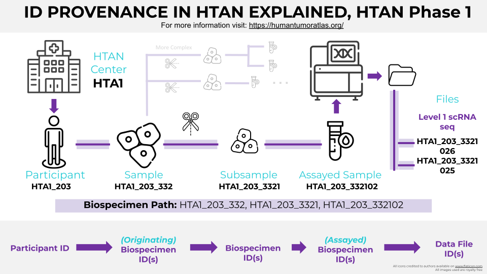

# Identifiers

All research participants, biospecimens and derived data within HTAN are associated with unique HTAN identifiers. The relationship 
between the identifiers is visually represented in Figure 1.


!!!
If you will be creating HTAN identifiers for an HTAN Center or Trans Network Project (TNP), please see the step-by-step directions in the [Data Submission Creating Identifiers](../data_submission/creating_ids.md) section of this manual. The [Creating Identifiers](../data_submission/creating_ids.md) section also includes information about how to track identifiers for your center. 
!!!

## ID to ID linkages

Note that the explicit linking of participants to biospecimens to data files is not encoded in the HTAN Identifier. Rather, the linking is encoded in explicit 
metadata elements (see [Relationship Model](relationships.md)).

## Phase 2 vs Phase 1 HTAN Identifiers
Small improvements to the HTAN Identifier system were introduced in Phase 2 of HTAN. Figure 1 represents some elements of the new identifier 
system. Namely, the inclusion of a “B” or a “D” in HTAN identifiers to distinguish biospecimen from data files.  Please see 
Figure 4 in [Phase 1 HTAN ID Provenance](#phase-1-htan-id-provenance) for comparison. The remainder of this page provides more details regarding HTAN Identifiers 
and is divided into Phase 2 and Phase 1 HTAN ID Provenance sections. 

## Phase 2 HTAN ID Provenance

Research participants are identified with the following pattern:

```
<participant_id> ::= <htan_center_id>_integer
```

Where the `htan_center_id` is the HTAN Center Prefix. (e.g. HTA200, HTA201) Please see [HTAN Centers](../overview/centers.md) for a full list of HTAN Center prefixes.

Biospecimens such as samples, tissue blocks, slides, aliquots and analytes obtained from a research participant have identifiers which follow the pattern:

```
<biospecimen_entity_id>	::= <participant_id>_Binteger
```

where the "B" before the integer denotes "Biospecimen".

For example, if research participant 1 within the Yale Lymphoma atlas (HTA209) provided three samples, you would have three biospecimen HTAN IDs:

```
HTA209_1_B1
HTA209_1_B3
HTA209_1_B8
```

Data files that result from those biospecimens have identifiers which follow the pattern:

```
<datafile_entity_id>	::= <participant_id>_Dinteger
```
where the "D" before the integer denotes "Data File".

For example, if an assay was performed on a biospecimen from the same Yale Lymphoma atlas (HTA209) participant, the data files would have HTAN IDs such as:

```
HTA209_1_D12
HTA209_1_D15
```
### Phase 2 Special Identifiers

#### Pooled samples and pooled files
If a biospecimen or data file is derived from more than one research participant, the biospecimen or data file identifier should use '0000' after the HTAN Center Prefix.

Figure 2 demonstrates use of '0000' for a pooled data file.


Figure 3 demonstrates use of '0000' for pooled biospecimen and data files.


#### Control/Blank samples
HTAN identifiers which contain 'EXT' indicate that the biospecimen or data file was either derived from an external control participant or a blank control.

Examples:
```
HTA209_EXT1_B1
HTA209_EXT2_D34
HTA209_EXT3_D590
```

## Phase 1 HTAN ID Provenance


Research participants are identified with the following pattern:

```
<participant_id> ::= <htan_center_id>_integer
```

Where the `htan_center_id` is the HTAN Center prefix. (e.g. HTA1, HTA2) Please see [HTAN Centers](../overview/centers.md) for a full list of HTAN Center prefixes.


Derivative data includes anything derived from a research participant, including biospecimens such as samples, tissue blocks, slides, aliquots, analytes, and data files that result from assaying those biospecimens. These identifiers follow the pattern:

```
<derivative_entity_id>	::= <participant_id>_integer
```

For example, if research participant 1 within the CHOP project (HTA4) has provided three samples, you would have three HTAN IDs, such as:

```
HTA4_1_1
HTA4_1_3
HTA4_1_8
```
### Phase 1 Special Identifiers

If a single data file is generated from one of those samples, that file could have an HTAN ID such as:

```
HTA4_1_42
```

If a single data file is derived from more than one participant, the file identifier may contain a wildcard string e.g. ‘0000’, after the HTAN center identifier. For example:

```
HTA4_0000_1
HTA4_0000_2
HTA4_0000_3
```

If a data file is derived from an external control participant, the biospecimen and file identifiers will contain the string ‘EXT’ before the external control participant integer.  For example:

```
HTA4_EXT1_1
HTA4_EXT2_2
HTA4_EXT3_3
```