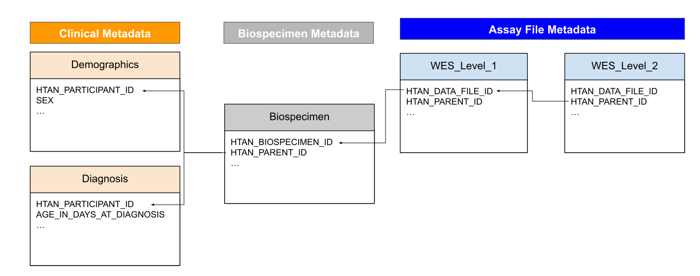
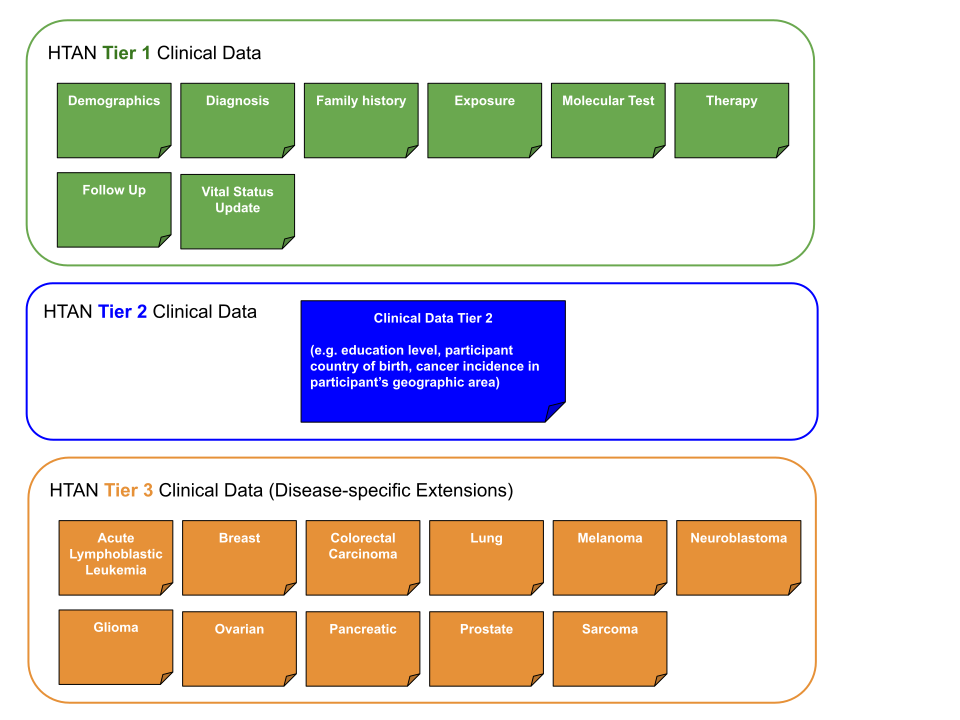

# Metadata Standards

Metadata means data *about* data.  Metadata enables both data searchability and interpretability. 

Metadata can be divided into broad categories:
1. clinical metadata;
2. biospecimen metadata; and
3. assay file metadata.

==- :icon-light-bulb: Conceptually, HTAN metadata can be thought of as a series of tables in a relational database. 
## Metadata Conceptual Diagram
Although the following diagram (Figure 1) is an oversimplification, it can help one conceptualize what the HTAN Metadata is. 
- Each headered rectangle in the diagram is a separate table or "manifest" which contains a set of attributes. 
- Attributes in the tables include identifiers such as the HTAN_PARENT_ID which help connect the data together. **Please see the [Relationship Model Page](relationships.md) in this manual for more specific information about connecting data together.**

===

==- :icon-light-bulb: Clinical Metadata is organized into Tiers.
## Clinical Metadata is organized into Tiers.
Clinical metadata is organized into tiers. The structure of these tiers differs in Phase 1 and Phase 2 of HTAN. In Phase 1 there were three clinical data tiers.  In Phase 2, there are two. For both phases, Tier 1 represents clinical data which is generally common to all studies and Atlases. Higher tiers are extensions to Tier 1, some of which are cancer or study-specific.  

### Phase 2 Clinical Metadata Tiers
In HTAN Phase 2, there are only two clinical metadata tiers. 
- Tier 1 metadata is divided into multiple categories, including Demographics, Diagosis, Family History, Exposure, Molecular Test, Therapy, Follow Up and Vital Status. 
- Tier 2 contains any cancer or study-specific clinical information which is not represented in Tier 1. Tier 2 is a flexible comma-separated value (csv) file. The only required attribute is HTAN Participant ID. All other attributes (columns headers) are determined by the submitting Center. 

Figure 2 provides a general representation of the model. 

### Phase 1 Clinical Metadata Tiers
In HTAN Phase 1, Tier 1 clinical metadata was based on the NCI's Genomic Data Commons (GDC) clinical data model.  Phase 1 clinical data was divided into three tiers:
- Similar to HTAN Phase 2, Tier 1 metadata was divided into multiple categories, including Demographics, Diagosis, Family History, Exposure, Molecular Test, Therapy, Follow Up and Vital Status Update. However, the attributes, valid values and requirements differ between Phase 1 and Phase 2 for each of these Tier 1 clinical metadata categories.  
- Phase 1 Tiers 2 and 3 are disease-agnostic (Tier 2) and disease-specific (Tier 3) extensions to the GDC model.

These tiers are shown in figure 3 and are described more on the [Phase 1 Clinical Data Page](https://humantumoratlas.org/standard/clinical). 

===

==- :icon-light-bulb: Biospecimen Metadata is submitted for both original and derived specimen.
## Original vs Derived Biospecimen
Biospecimen metadata includes the original biopsy or surgical specimen as well as any derived specimen (e.g. a tissue section or slide) which were subsequently used for an assay. 
- Derived specimen connect to originating specimen via HTAN_PARENT_ID. (The derived specimen's HTAN_PARENT_ID is the HTAN_BIOSPECIMEN_ID of the originating specimen.) 
- An originating specimen's HTAN_PARENT_ID would be the HTAN_PARTICIPANT_ID. 
===

==- :icon-light-bulb: Assay File Metadata corresponds to Assay File Levels.
## Assay File Metadata
HTAN divides assay data files into levels which increase from level 1 (raw data) to level 4 (derived cohort-level data).  Please see the [File Standards Page](file_standards.md/#assay-data-levels) for more information about assay data levels. 

Assay file metadata corresponds to each assay file level. For example, Whole Exome Sequencing (WES) data currently has 3 file levels. As a result, there are 3 levels of WES assay metadata which are collected -- one for each file level. The metadata are referenced in this manner e.g. "WES - Level 1", "WES - Level 2", "WES - Level 3" in the HTAN Phase 2 Data Model and "Bulk DNA Level 1", "Bulk DNA Level 2", "Bulk DNA Level 3" in the HTAN Phase 1 Model.
===

The HTAN DCC maintains a set of code in github repositories (one for each Phase of HTAN) to document and validate metadata. Specific information about what attributes are collected, which attributes are required and valid values are also provided to help data contributors.  These resources may also be helpful to data users.

| HTAN Phase | Github Repository | Detailed Documentation |
|------------|-------------------|------------------------|
| **Phase 2**   |[!button text="HTAN Phase 2 Data Model (Metadata) Github Repository"](https://github.com/ncihtan/htan2-data-model) | [!button text="HTAN Phase 2 Data Model (Metadata) Documentation"](https://htan2-data-model.readthedocs.io/en/main/) |
| **Phase 1**   | [!button text="HTAN Phase 1 Data Model (Metadata) Github Repository"](https://github.com/ncihtan/data-models) | [!button text="HTAN Phase 1 Data Model (Metadata) Documentation"](https://humantumoratlas.org/standards) |
