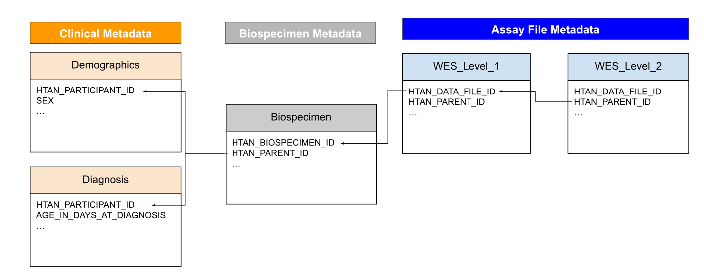
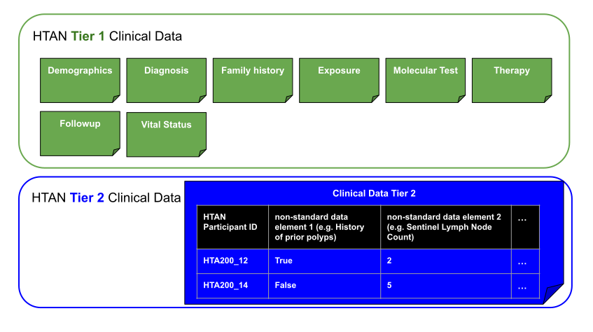
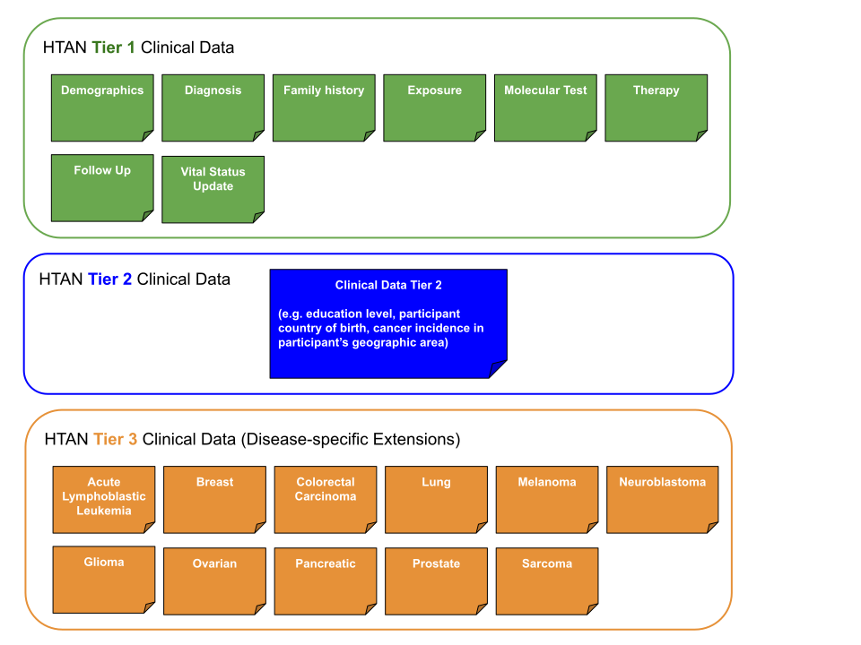

# Metadata Standards

+++ Overview

Metadata means data *about* data.  Metadata enables both data searchability and interpretability. 

Metadata can be divided into broad categories:
1. clinical metadata;
2. biospecimen metadata; and
3. assay file metadata.

==- :icon-light-bulb: Conceptually, HTAN metadata can be thought of as a series of tables in a relational database. 
## Metadata Conceptual Diagram
Although the following diagram (Figure 1) is an oversimplification, it can help one conceptualize what the HTAN Metadata is. 
- Each headered rectangle in the diagram is a separate table or "manifest" which contains a set of attributes. 
- Attributes in the tables include identifiers such as the HTAN_PARENT_ID which help connect the data together. **Please see the [Relationship Model Page](relationships.md) in this manual for more specific information about connecting data together.**

===

==- :icon-light-bulb: Clinical Metadata is organized into Tiers.
## Clinical Metadata is organized into Tiers.
Clinical metadata is organized into tiers. The structure of these tiers differs in Phase 1 and Phase 2 of HTAN. In Phase 1 there were three clinical data tiers.  In Phase 2, there are two. For both phases, Tier 1 represents clinical data which is generally common to all studies and Atlases. Higher tiers are extensions to Tier 1, some of which are cancer or study-specific.  

### Phase 2 Clinical Metadata Tiers
In HTAN Phase 2, there are only two clinical metadata tiers. 
- Tier 1 metadata is divided into multiple categories, including Demographics, Diagosis, Family History, Exposure, Molecular Test, Therapy, Follow Up and Vital Status. 
- Tier 2 contains any cancer or study-specific clinical information which is not represented in Tier 1. Tier 2 is a flexible comma-separated value (csv) file. The only required attribute is HTAN Participant ID. All other attributes (columns headers) are determined by the submitting Center. 

Figure 2 provides a general representation of the model. 

### Phase 1 Clinical Metadata Tiers
In HTAN Phase 1, Tier 1 clinical metadata was based on the NCI's Genomic Data Commons (GDC) clinical data model.  Phase 1 clinical data was divided into three tiers:
- Similar to HTAN Phase 2, Tier 1 metadata was divided into multiple categories, including Demographics, Diagosis, Family History, Exposure, Molecular Test, Therapy, Follow Up and Vital Status Update. However, the attributes, valid values and requirements differ between Phase 1 and Phase 2 for each of these Tier 1 clinical metadata categories.  
- Phase 1 Tiers 2 and 3 are disease-agnostic (Tier 2) and disease-specific (Tier 3) extensions to the GDC model.

These tiers are shown in figure 3 and are described more on the [Phase 1 Clinical Data Page](https://humantumoratlas.org/standard/clinical). 

===

==- :icon-light-bulb: Biospecimen Metadata is submitted for both original and derived specimen.
## Original vs Derived Biospecimen
Biospecimen metadata includes the original biopsy or surgical specimen as well as any derived specimen (e.g. a tissue section or slide) which were subsequently used for an assay. 
- Derived specimen connect to originating specimen via HTAN_PARENT_ID. (The derived specimen's HTAN_PARENT_ID is the HTAN_BIOSPECIMEN_ID of the originating specimen.) 
- An originating specimen's HTAN_PARENT_ID would be the HTAN_PARTICIPANT_ID. 
===

==- :icon-light-bulb: Assay File Metadata corresponds to Assay File Levels.
## Assay File Metadata
HTAN divides assay data files into levels which increase from level 1 (raw data) to level 4 (derived cohort-level data).  Please see the [File Standards Page](file_standards.md/#assay-data-levels) for more information about assay data levels. 

Assay file metadata corresponds to each assay file level. For example, Whole Exome Sequencing (WES) data currently has 3 file levels. As a result, there are 3 levels of WES assay metadata which are collected -- one for each file level. The metadata are referenced in this manner e.g. "WES - Level 1", "WES - Level 2", "WES - Level 3" in the HTAN Phase 2 Data Model and "Bulk DNA Level 1", "Bulk DNA Level 2", "Bulk DNA Level 3" in the HTAN Phase 1 Model.
===

+++ Phase 1

The HTAN DCC maintains a set of code in github repositories (one for each Phase of HTAN) to document and validate metadata. Specific information about what attributes are collected, which attributes are required and valid values are also provided to help data contributors.  These resources may also be helpful to data users.

| HTAN Phase | Github Repository | Detailed Documentation |
|------------|-------------------|------------------------|
| **Phase 1**   | [!button text="HTAN Phase 1 Data Model (Metadata) Github Repository"](https://github.com/ncihtan/data-models) | see below |

Please click on the panels below to download files which describe Phase 1 Metadata Attributes.

==- KEY
KEY for All downloadable Phase 1 Metadata files.

| Columns Names | Description |
|---------------|-------------|
| **Attribute** | The name of the metadata element.|
| **Manifest Name**| Which metadata file(s) contains the attribute. Manifest Name contains a comma separated list where applicable.|
|**Description**| A description of the attribute. |
|**Required**:| TRUE/FALSE. If the attribute was always required in the metadata file(s).|
|**Conditional If**| When not empty, indicates that the attribute was required when the condition was met.|
|**Data Type**| All values were String.|
|**Valid Values**| When not empty, the attribute must be one of the valid values in the list.|
===

==- All Attributes

[Download All Phase 1 HTAN Metadata Attributes](../assets/HTAN_phase1_metadata.csv)
===

==- Clinical Metadata

[Download Phase 1 Clinical Attributes](../assets/HTAN_phase1_clinical.tsv)

Phase 1 HTAN clinical data consists of three tiers.
Tier 1 is based on the NCI Genomic Data Commons (GDC) clinical data model, while Tiers 2 and 3 are extensions to the GDC model.

| Tier	| Description |
|-------|-------------|
| 1	| Seven categories of clinical data, based on the GDC clinical data model.|
| 2	| HTAN disease-agnostic extensions to the GDC clinical data model.|
| 3	| HTAN disease-specific extensions to the GDC clinical data model. |

### Tier 1 Clinical Data
| Category	| Description |
|-----------|-------------|
| Demographics| Data for the characterization of the patient by means of segmenting the population (e.g., characterization by age, sex, or race). |
| Diagnosis | Data from the investigation, analysis and recognition of the presence and nature of disease, condition, or injury from expressed signs and symptoms; also, the scientific determination of any kind; the concise results of such an investigation. |
| Exposure	| Clinically relevant patient information not immediately resulting from genetic predispositions. |
| Family History | Record of a patient's background regarding cancer events of blood relatives. |
| Follow-up	| A visit by a patient or study participant to a medical professional. A clinical encounter that encompasses planned and unplanned trial interventions, procedures and assessments that may be performed on a subject. A visit has a start and an end, each described with a rule. The process by which information about the health status of an individual is obtained before and after a study has officially closed; an activity that continues something that has already begun or that repeats something that has already been done. |
| Molecular Test | Information pertaining to any molecular tests performed on the patient during a clinical event. |
| Participant Vital Status Update | Implemented in May 2024. This manifest is used to update a participant's vital status if new information is available. Prior to May 2024, vital status was rewritten in the demographics manifest when updates were available. |
| Therapy | Record of the administration and intention of therapeutic agents provided to a patient to alter the course of a pathologic process. |

### Tier 2 and 3 Clinical Data
Tier 2 consists of **disease-agnostic** extensions to the GDC clinical data model.

Tier 3 consists of **disease-specific** extensions to the GDC clinical data model. This covers additional elements for Acute Lymphoblastic Leukemia (ALL), Brain Cancer, Breast Cancer, Lung Cancer, Melanoma, Ovarian Cancer, Pancreatic Cancer, Prostate Cancer and Sarcoma.
===

==- Biospecimen
[Download Phase 1 Biospecimen Attributes](../assets/HTAN_phase1_biospecimen.tsv)

The HTAN biospecimen data model is designed to capture essential biospecimen data elements, including:

Acquisition method, e.g. autopsy, biopsy, fine needle aspirate, etc.
Topography Code, indicating site within the body, e.g. based on ICD-O-3.
Collection information e.g. time, duration of ischemia, temperature, etc.
Processing of parent biospecimen information e.g. fresh, frozen, etc.
Biospecimen and derivative clinical metadata i.e. Histologic Morphology Code, e.g. based on ICD-O-3.
Coordinates for derivative biospecimen from their parent biospecimen.
Processing of derivative biospecimen for downstream analysis e.g. dissociation, sectioning, analyte isolation, etc.

Phase 1 HTAN biospecimen metadata leveraged existing common data elements from four sources:

[Genomic Data Commons (GDC)](https://gdc.cancer.gov/about-data/gdc-data-processing/biospecimen-data-standardization)
Consortium for Molecular and Cellular Characterization of Screen-Detected Lesions (MCL)
[Human Cell Atlas (HCA)](https://data.humancellatlas.org/metadata)
NCI standards described in the caDSR system
===

==- Electron Microscopy
[Download Phase 1 Electron_Microscopy Attributes](../assets/HTAN_phase1_electron_microscopy.tsv)

| Assay Type | Level |	Definition | Example Data |
|------------|-------|-------------|--------------|
| Electron Microscopy | 1|	Raw electron microscopy data as one TIFF file per plane for a 3D image stack or per tile for a 2D large area montage. |	tiff |
||2	|Processed electron microscopy data as one OME-TIFF image per plane or montage. |	ome-tiff |
||3	|Segmented electron microscopy data. |	am, tiff |
||4	| Movies or other derived files from electron microscopy data. |	mp4, csv |
===

==- Imaging
[Download Phase 1 Imaging Attributes](../assets/HTAN_phase1_imaging.tsv)

The HTAN data model for imaging data is based upon the [Minimum Information about Tissue Imaging (MITI)](https://www.miti-consortium.org/) reporting guidelines. These comprise minimal metadata for highly multiplexed tissue images and were developed in consultation with methods developers, experts in imaging metadata (e.g., DICOM and OME) and multiple large-scale atlasing projects; they are guided by existing standards and accommodate most multiplexed imaging technologies and both centralized and distributed data storage.

For further information on the MITI guidelines, please see the [MITI website](https://www.miti-consortium.org/), [specification on Github](https://github.com/miti-consortium/MITI), and [Nature Methods](https://www.nature.com/articles/s41592-022-01415-4) publication.

The HTAN data model for imaging was intended primarily for multiplexed imaging, such as CODEX, CyCIF, and IMC, in addition to brightfield imaging of H&E stained tissues.

| Assay Type | Level |	Definition | Example Data | Notes |
|------------|-------|-------------|--------------|-------|
| Imaging | 1 | Raw imaging data requiring tiling, stitching, illumination correction, registration or other pre-processing. | svs, tiff | usually not submitted |
||2	|Imaging data compiled into a single file format, preferably a tiled and pyramidal OME-TIFF. Accompanied by a csv file containing channel metadata. | ome-tiff + csv||
||3	| Segmentation mask, Validated channel metadata, QC checked image. | ome-tiff ||
||4 |An object-by-feature table (typically cell-by-marker) generated from the segmentation mask and image. | csv ||
===

==- Mass Spectrometry
[Download Phase 1 Mass Spectrometry Attributes](../assets/HTAN_phase1_mass_spectrometry.tsv)

The Phase 1 HTAN Mass Spectrometry Standard was developed with a focus on Proteomics data. 

| Assay Type | Level |	Definition | Example Data |
|------------|-------|-------------|--------------|
| Mass Spectrometry | 1	| Raw spectral data. |	mz5,dta,ms2,ms1,mzXML,mzML,mzData |
||2	| Spectrum match peaks.	| Peptide spectrum match (PSM) in csv format |
|| 3 |	Peptide Group information | Combined peptide spectrum as csv or tsv files |
||4	| Protein Abundance. |	csv, tsv |
===

==- Proteomics
[Download Phase 1 Proteomics Attributes](../assets/HTAN_phase1_proteomics.tsv)

| Assay Type | Level |	Definition | Example Data | Notes |
|------------|-------|-------------|--------------|-------|
| RPPA | 2 | Primary data. Array based protemics. | csv | (No level 1 for RPPA)|
|| 3 | Intra-batch normalized intensities. | txt,csv ||
|| 4 | Intra-batch corrected intensities. | txt ||
===

==- Sequencing
[Download Phase 1 Sequencing Attributes](../assets/HTAN_phase1_sequencing.tsv)

In alignment with The Cancer Genome Atlas and the NCI Genomic Data Commons, sequencing data are divided into four levels:

| Assay Type | Level |	Definition | Example Data | Notes |
|------------|-------|-------------|--------------|-------|
| Sequencing | 1	| Raw data	| FASTQs, unaligned BAMs ||
||2	| Aligned primary data |	Aligned BAMs ||
||3	| Derived biomolecular data	| Gene expression matrix files, VCFs, etc. | no level 3 for scDNA-seq and scmC-seq |
||4	| Sample level summary data. |	t-SNE plot coordinates, etc. | no level 4 for scDNA-seq, scmC-seq, Bulk DNA-seq, Bulk RNA-seq, HiC-Seq, Bulk Methylation-Seq |
===

==- Spatial Transcriptomics
[Download Phase 1 Spatial Transcriptomics Attributes](../assets/HTAN_phase1_spatial_transcriptomics.tsv)

Support for several spatial sequencing modalities was added near the end of HTAN Phase 1. Spatial transcriptomics assays had platform-specific data levels which deviated from the traditional HTAN file level schema. Specifically,
* some platforms have only one experiment level instead of multiple file levels (10X Xenium ISS and Nanostring CosMx SMI); and
* some platforms have additional files (auxiliary or annotation metadata) which were not a part of the typical 4 level system (e.g. 10X Visium, Nanostring GeoMx DSP).

| Assay Type | Level |	Definition | Example Data | Notes |
|------------|-------|-------------|--------------|-------|
 Spatial Transcriptomics, Nanostring CosMx SMI | Experiment | RNA and Protein Panel assays applied as part of Nanostring CosMx Spatial Molecular Imager (SMI) | experiment bundle submitted instead of multiple file levels. |
| Spatial Transcriptomics, Nanostring GeoMx DSP| 1 | Files contain raw data output from the NanoString GeoMx DSP Pipeline. These can include RCC or DCC Files. | rcc, dcc||
|| 3 | Files contain processed data from the NanoString GeoMx DSP Pipeline. This level depends on GeoMx Level 1 and Imaging Level 2. | csv | Associated ome-tiff images submitted using the Imaging Level 2 manifest. |
|| DCC ROI Segment Annotation | GeoMx ROI and Segment Metadata Attributes. The assayed biospecimen should be reported one per row with the associated ROI coordinates. | ||
|| RCC ROI Segment Annotation | GeoMx ROI and Segment Metadata Attributes. The assayed biospecimen should be reported one per row with the associated ROI coordinates. | ||
| Spatial Transcriptomics, Slide-Seq | 1 | Raw sequencing files for the Slide-seq assay. | tar.gz (FASTQ) ||
|| 2 | Aligned sequencing files and QC for the Slide-seq assay. | BAM ||
|| 3 | Gene matrices with features and barcodes for Slide-seq as well as spatial information (bead location files). | tsv, mtx.gz ||
| Spatial Transcriptomics, 10x Visium | 1 | Files contain raw RNA-seq data associated with spot/slide data. | FASTQ ||
|| 2 | Alignment workflows downstream of Spatial Transcriptomics RNA-seq Level 1. | Aligned BAMS ||
|| 3 | Processed data files based on Spatial Transcriptomics RNA-seq Level 2 and Spatial Transcriptomics Auxiliary files. | Barcodes, features, filtered and unfiltered matrices ||
|| 4 | Processed data files based on Spatial Transcriptomics RNA-seq Level 3. | Clustering, t-SNE coordinates, h5ad, RDS | |
|| Auxiliary | Auxiliary data associated with spot/slide analysis (aligned Images, quality control files, etc) from Spatial Transcriptomics. Additional data such as imaging, qc, and json scale factors. | TIFF, JPG, PNG, JSON, HTML, etc. ||
| Spatial Transcriptomics, 10X Xenium ISS | Experiment | All data pertaining to the 10X Genomics Xenium In-Situ Hybridization experiment | experiment bundle | experiment bundle submitted instead of multiple file levels. |
===

+++ Phase 2

The HTAN DCC maintains a set of code in github repositories (one for each Phase of HTAN) to document and validate metadata. Specific information about what attributes are collected, which attributes are required and valid values are also provided to help data contributors.  These resources may also be helpful to data users.

| HTAN Phase | Github Repository | Detailed Documentation |
|------------|-------------------|------------------------|
| **Phase 2**   |[!button text="HTAN Phase 2 Data Model (Metadata) Github Repository"](https://github.com/ncihtan/htan2-data-model) | [!button text="HTAN Phase 2 Data Model (Metadata) Documentation"](https://htan2-data-model.readthedocs.io/en/main/) |

