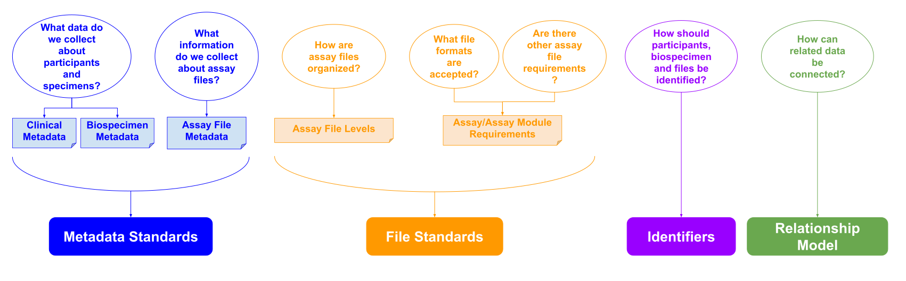

# Data Model Introduction

All HTAN Centers are required to encode their data and metadata in a **common HTAN Data Model**. The HTAN Data Model is created via a community Request for Comment (RFC) process, with participation from all HTAN Centers, and covers clinical, biospecimen, genomic, transcriptomic, proteomic, imaging and spatial profiling data.

The HTAN Data Model encompasses **Metadata Standards**, **File Standards**, **Identifiers** and a **Relationship Model**. 

==- :icon-light-bulb: What do we mean by "Data Model"
- **Metadata Standards** are the attributes and valid values collected to describe participants (clinical metadata), specimens (biospecimen metadata) and assay files. 
- **File standards** include how files are organized (assay data levels), what file formats are accepted and specific requirements for the assay files themselves.
- **Identifiers** for participants, biospecimen and files indicate which HTAN Center contributed the data and provide a mechanism for relating different data files to each other. For this reason, HTAN has specific requirements for HTAN identifiers. 
- The **Relationship Model** describes how related data are connected to each other such as which specimens were used to produce data from a particular assay.

===
HTAN has had two phases:
- HTAN Phase 2 (2025-present)
- HTAN Phase 1 (2018-2025)

==- :icon-alert: The Phase 1 and Phase 2 Data Models Differ.

Where possible, the **HTAN Phase 1 Data Model** leveraged previously defined data standards across the scientific research community, including the [NCI Genomic Data Commons](https://gdc.cancer.gov/), the [Human Cell Atlas](https://www.humancellatlas.org/), the [Human Biomolecular Atlas Program (HuBMAP)](https://hubmapconsortium.org/) and the [Minimum Information about Tissue Imaging (MITI)](https://www.miti-consortium.org/) reporting guidelines.

In **HTAN Phase 2**, the Data Model was updated with three main aims:
1. Align the HTAN Data Model with the NCI's Cancer Research Data Commons ([CRDC](https://datacommons.cancer.gov/)) standards. 
2. Add or enhance existing standards to accommodate new assays. 
3. Refine and strengthen the model to support FAIR data sharing principles, by 
    - eliminating unused attributes;
    - changing requirements and valid values; 
    - clarifying attribute definitions; and
    - standardizing data file formats where possible. 

**For these reasons, Phase 1 and Phase 2 data may differ in terms of the file formats, metadata valid values or types of attributes collected.**
===