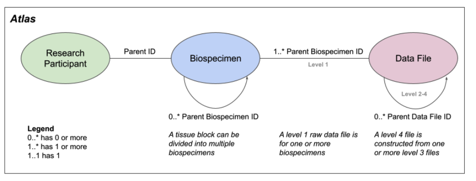
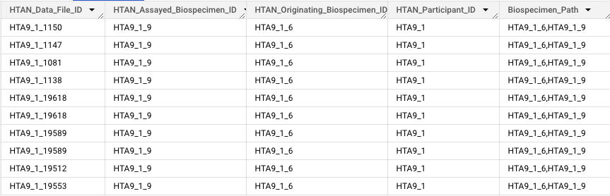
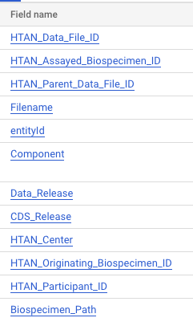

# Relationship Model

Each atlas in HTAN contains data provided by multiple research participants, who have donated biospecimens (see Figure below). The metadata allows one to trace back any data file to the donated biospecimen. Level 1 raw data files are directly linked to the corresponding biospecimen, whereas processed level 2-4 data files are linked to lower level parent data files. Note also that biospecimens can be connected recursively.

# HTAN ID Provenance

The HTAN DCC has constructed an ID Provenance BigQuery table, which contains upstream biospecimen and participant information for each HTAN data file. The motivation for constructing the table arose from the need for a straightforward method of showcasing how HTAN data files are linked to biospecimens and patients.

Although this information is available in HTAN, connections among assay file levels and parent relationships (both biospecimen and file) were previously only accessible by tracing through parent identifiers. Having all ID information in one place can significantly speed up analyses, exploration, and data sharing.

The Provenance BigQuery table is accessible via ISB-CGC. See [Google BigQuery](../open_access/big_query.md)

## Biospecimen Attribute Definitions

Given the complexity of biospecimen relationships, we've adopted the following nomenclature to describe biospecimen lineages:

* **Originating Biospecimen**: the biopsied or resected biospecimen from the patient from which the assay data were derived

* **Assayed Biospecimen**: the biospecimen directly assayed using the experimental platform

* **Biospecimen Path**: path of biospecimens from Originating to Assayed; comma-separated

![HTAN ID Provenance Explained: This figure shows the ID Provenance from HTAN center, to participant, down to the file level of assayed biospecimen. The path begins with a participant ID `HTA1_203`. The participant has had a sample collected at HTAN center `HTA1`. Once the sample is collected, it is refered to as a `Biospecimen`. Depending on the stage of processing of the biospecimen, this can be refered to as the `originating` or `assayed biospecimen` (shown on the right-hand side in the flow diagram). In this case, the sample is given an originating biospecimen ID of `HTA1_203_332`. This sample is then subsampled to produce `HTA1_203_3321` and subsequently assayed with scRNA seq to produce files with data file IDs: `HTA1_203_3321026` and `HTA1_203_3321025`. The full Biospecimen path is shown in purple at the bottom of the figure.](../img/provenance1.png)

## Provenance Table Construction
As illustrated in the figure above, biospecimens can be subsampled multiple times. However, HTAN metadata tables provide only the immediate parent biospecimen. To assemble the full biospecimen path, we perform a series of joins on the biospecimen table, walking up the parent biospecimen ancestry chain until no further parents are found. 

Similarly, we can have up to four data file ‘levels’. Each data file is linked using its provided parent HTAN data file ID(s). 

We then join biospecimen information with file-level annotations to form the final ID provenance table.

## Table Structure

In addition to upstream biospecimen and participant IDs, the provenance table also includes a number of informational columns, such as `entityId` (Synapse ID of the source file), `HTAN_Center` (text version of center code), and `Data_Release` and `CDS_Release` which indicate which HTAN Portal release and CDS release the file was included in, respectively.

