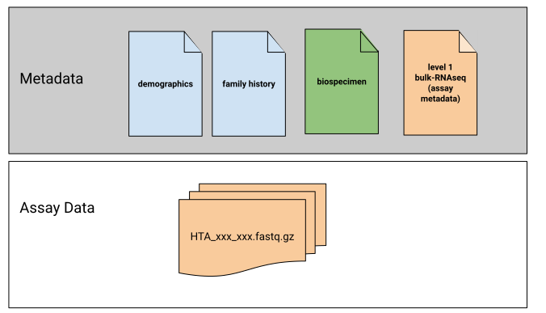

# Specific Standards

HTAN Centers submit assay data files and [metadata](../data_submission/metadata.md) to HTAN. HTAN's Data Models govern how the assay data is organized and what metadata accompanies the assay data. The data model changed in HTAN Phase 2.

For **HTAN Phase 2**, there are both metadata standards as well as specific file requirements. 
- Interactive, searchable and downloadable summaries of metadata requirements are provided [here](https://htan2-data-model.readthedocs.io/en/latest/index.html). 
- Specific file requirements for single cell RNA-seq h5ad files are modeled after [CELLxGENE's requirements](https://cellxgene.cziscience.com/docs/032__Contribute%20and%20Publish%20Data). Please see the [Phase 2 Single Cell RNA-seq page](../data_submission/scrnaseq_data_submission.md) for more information.  

For **HTAN Phase 1**, [The HTAN Portal's Data Standards pages](https://humantumoratlas.org/standards) provide interactive, searchable and downloadable summaries of the metadata attributes, requirements and valid values expected for each data type.    