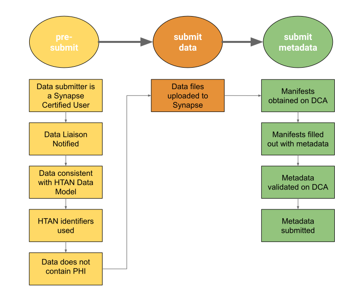

# Submitting Assay Data and Metadata

As stated in [Data Submission Overview](../data_submission/overview.md), data submission involves two key steps:
1. Uploading assay data files to Synapse; and
2. Completing and validating metadata using the Data Curator App (DCA).

This page provides details regarding those steps.  

To submit data, you will also need to understand the HTAN data model and specific requirements for your particular data type.  For a general overview of the HTAN data model, please see [HTAN Data Model](../data_model/overview.md).  To understand specific requirements for your data type, please see [Data Standards](https://humantumoratlas.org/standards).

HTAN uses the Synapse [Portal](https://www.synapse.org) and [DCA](https://dca.app.sagebionetworks.org/), developed and maintained by [Sage Bionetworks](https://sagebionetworks.org/), to manage clinical, biospecimen and assay data submissions (dataset ingress). In order to submit data, your center should:

1. [Have at least one user with Certified User status on Synapse.](#have-at-least-one-user-with-certified-user-status-on-synapse)
2. [Contact your Data Liaison to set up your project and cloud bucket.](#contact-your-data-liaison-to-set-up-your-project-and-cloud-bucket)
3. [Ensure the assay dataset conforms to the HTAN Data Model, uses HTAN Identifiers and does not contain Protected Health Information (PHI).](#ensure-the-dataset-conforms-to-the-htan-data-model-uses-htan-identifiers-and-does-not-contain-phi)
4. [Organize and upload your dataset to the Synapse Project](#organize-and-upload-your-dataset-to-the-synapse-project) 
5. [Validate and submit metadata using the DCA.](#validate-and-submit-metadata-using-synapses-data-curator-app-dca)

Please read the rest of this page for more information about each of these steps.

## Have at least one user with Certified User status on Synapse.
To upload files to the Synapse Platform, you need to be a [Synapse Certified User](https://help.synapse.org/docs/Synapse-User-Account-Types.2007072795.html). Because Synapse stores data from human subjects research, Sage Bionetworks requires that you demonstrate understanding of and compliance with privacy and security issues. You can complete your certification by taking a short certification quiz. Please see the Synapse [Certified User Documentation](https://help.synapse.org/docs/Synapse-User-Account-Types.2007072795.html) for more information.

## Contact your Data Liaison to set up your project and cloud bucket.

When you are ready to upload data, please contact your [data liaison](../data_submission/Data_Liaisons.md). Your data liaison will need to know:
1. Your centers
2. Who on your team will be doing the data upload.
3. The synapse usernames for team members identified in #2.

Please have users obtain certified user status prior to contacting your data liaison.

With the above information, the DCC will initialize your Synapse project for metadata submission and a cloud storage location for dataset uploads. If the data submission is for a new atlas, the DCC will also create an HTAN atlas ID.  Once your Synapse project has been initialized, your data liaison will reach out to you with the location of your Synapse project and you can begin uploading your data.

## Ensure the dataset conforms to the HTAN Data Model, uses HTAN Identifiers and does not contain PHI.

The HTAN Data Model is built upon data standards described on the [Data Standards](https://data.humantumoratlas.org/standards) page. All HTAN Centers are required to encode their clinical, biospecimen and assay data and metadata using the HTAN Data Model. If you have a new data type which is not currently represented in the HTAN Data Model, please contact your data liaison.

A concrete way to understand the expectations for data submissions is to view the metadata templates (manifests) for clinical, biospecimen and assay data available in the ([DCA](https://dca.app.sagebionetworks.org/)). For any given dataset, you may be submitting:

- clinical manifest(s), e.g. Demographics, Diagnosis
- biospecimen manifest(s)
- assay manifest(s), e.g. Bulk RNA-seq level 1 
- assay data files

The first three items will be validated and submitted using the DCA. The last item, assay data files, only needs to be uploaded to the synapse project itself.

All data should be identified using HTAN identifiers. Please see the [HTAN Identifier](../data_model/identifiers.md) section of this manual for more information regarding HTAN identifiers.

!!! *Please review your data to ensure that it does not contain PHI.*
!!!

## Organize and upload your dataset to the Synapse Project

Please organize your data using the flattened data layout described in Synapse's [Data Ingress Docs](https://dca-docs.scrollhelp.site/DCA/Working-version/HTAN/organize-your-data-upload#OrganizeyourDataUpload-FlattenedDataLayoutExample)

Data files can be transferred using the Synapse User Interface (Synapse UI) or programmatically. Please see Synapse's [Data Ingress Docs](https://dca-docs.scrollhelp.site/DCA/Working-version/HTAN/uploading-data) for more information on how to upload files. 

!!! If you upload files to Synapse programmatically, please use synapseclient version 3.0.0 or higher. 
!!!

## Validate and submit metadata using Synapse's Data Curator App (DCA).

The DCA contains HTAN-specific metadata templates which can be completed on the app or downloaded.  Once these are completed by your center, they should then be validated and submitted via the DCA.  

Please see Synapse's [Data Ingress Docs](https://dca-docs.scrollhelp.site/DCA/Working-version/HTAN/validate-and-submit-your-metadata) for more details regarding the web app.
