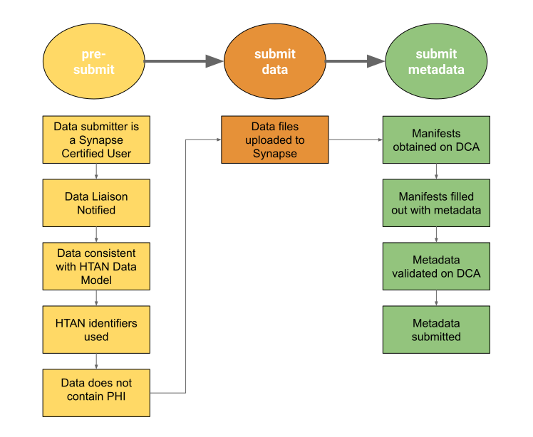
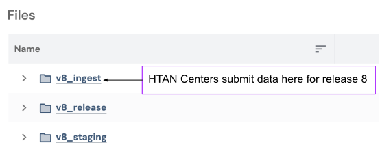
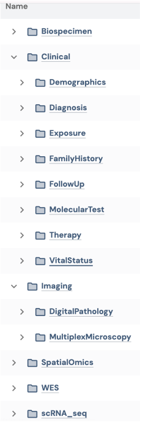

# Data Submission Overview

[Data Submission Introduction](../data_submission/overview.md) provides a general overview for submitting data and metadata to HTAN. This page provides details regarding those steps.

+++ Overview
### Data Submission Steps
1. Complete Pre-submission Tasks;
2. Submit Data; and
3. Submit Metadata;

An HTAN Center uploads data to its HTAN Synapse Project. The project is organized into versioned folders which are tied to the HTAN Data Model. Please see the other tabs on this page for more information about Synapse Project organization and each of the data submission steps. 
{ style="width: 50%;" }

+++ Pre-submission Tasks
### Pre-submission Tasks

- [ ] Have at least one user with Certified User status on Synapse.

> To upload files to the Synapse Platform, you need to be a <a href="https://docs.synapse.org/synapse-docs/synapse-user-account-types" target="_blank" rel="noopener noreferrer">Synapse Certified User</a>. You can complete your certification by taking a short certification quiz. Please see the Synapse  <a href="https://docs.synapse.org/synapse-docs/synapse-user-account-types" target="_blank" rel="noopener noreferrer">Certified User Documentation</a> for more information. Please also be aware that use of Synapse requires agreement to the latest Synapse Terms of Service. Synapse users must also enable two-factor authentication (2FA). You can find information about the latest TOS and guidance on enabling 2FA on your account  <a href="https://sagebionetworks.org/trust-center" target="_blank" rel="noopener noreferrer">here</a>.

- [ ] Contact your Data Liaison

> When you are ready to upload data, please contact your [data liaison](../data_submission/Data_Liaisons.md). Please have users obtain certified user status prior to contacting your data liaison. If you have not submitted data previously, your Data Liaison may also need to ensure you have the proper access rights for you Synapse Project.

- [ ] Ensure the dataset conforms to the HTAN Data Model and uses HTAN Identifiers.

> The HTAN Data Model is built upon data standards described on the [Data Model](../data_model/overview.md) page. All HTAN Centers are required to encode their clinical, biospecimen and assay data and metadata using the HTAN Data Model. If you have a new data type which is not currently represented in the HTAN Data Model, please contact your data liaison.

> All data should be identified using HTAN identifiers. Please see the [Identifiers](../data_model/identifiers.md) and [Creating HTAN Identifiers](../data_submission/creating_ids.md) sections of this manual for more information regarding HTAN identifiers.

- [ ] Ensure that your data does not contain PHI.

> **Please review your data to ensure that it does not contain PHI.** The HTAN DCC cannot accept data with PHI, including dates less than a year. For example, dates in metadata must be converted to [days from birth](../data_submission/dates.md) and all image files must have PHI removed from file headers.

+++ Synapse Project Organization 
### HTAN Center Folder Structure
For each data release, the HTAN Data Coordinating Center (DCC) will create a set of 3 folders (Figure 2):
- v#_ingest;
- v#_stage; and
- v#_release.

For example, the folders v8_ingest, v8_stage and v8_release were added to each Center's Synapse Project for the first Phase 2 HTAN data release (v8). When the DCC is ready to accept data for release v9, new folders (v9_ingest, v9_stage and v9_release) will be added to each HTAN Center's Synapse Project.

**HTAN Centers** upload their data to the appropriate location within the **ingest folder**.  The stage and release folders are then used by the DCC to track data which have passed all validation tests (stage) and data which were released to a data portal (release). 

{ style="width: 60%;"}

Within the ingest folder, there are subfolders which are tied to the HTAN Data Model. For example, at the time of the v8 release, Clinical and Biospecimen records were supported as well as the following assays: Digital Pathology, Multiplex Microscopy, sc/snRNA-sequencing, SpatialOmics and Whole Exome Sequencing (WES). As a result, subfolders for each data type exist within the ingest folder as shown in Figure 3.

{ style="width: 30%;" }

+++ Submit Data
### Upload Data Files

Data files can be transferred to the appropriate Synapse folder either by using the Synapse User Interface (Synapse UI) or programmatically. 

- To upload files using the Synapse User Interface, follow Synapse's <a href="https://docs.synapse.org/synapse-docs/uploading-and-organizing-data-into-projects-files-and-folders#Uploading-a-File-via-the-Synapse-UI" target="_blank" rel="noopener noreferrer">Uploading a File (via Synapse UI)</a> directions.
- To upload the files programmatically, please follow Synapse's <a href="https://docs.synapse.org/synapse-docs/uploading-and-organizing-data-into-projects-files-and-folders#Uploading-a-File-Programmatically" target="_blank" rel="noopener noreferrer">Uploading a File Programmatically</a> directions. Contributors are encouraged to use the Python client for programmatic uploads.  

For large file uploads, Synapse also provides guidance in <a href="https://python-docs.synapse.org/en/stable/tutorials/python/upload_data_in_bulk/" target="_blank" rel="noopener noreferrer">this tutorial</a> regarding uploading data in bulk.  

!!! If you upload files to Synapse programmatically using the python client, please use synapseclient version 3.0.0 or higher. 
!!!

+++ Submit Metadata
### Submit Metadata

Synapse provides a curator within its platform for creating and managing metadata. Please see <a href="https://docs.synapse.org/synapse-docs/managing-metadata-with-curator" target="_blank" rel="noopener noreferrer">their documentation</a> for information about using the curator. Please see the [Metadata Standards](../data_model/metadata_standards.md) page of this manual for more information about Phase 2 HTAN Metadata requirements. 

In the Synapse system, metadata can be **File-based** (associated with a data file) or **Record-based**. Please see <a href="https://docs.synapse.org/synapse-docs/managing-metadata-with-curator#About" target="_blank" rel="noopener noreferrer">Synapse's Documentation</a> for more information about these terms.

For HTAN: \
**Record-based** metadata includes the Clinical and Biospecimen modules of the HTAN2 Data Model. \
**File-based** metadata includes all other modules in the HTAN2 Data Model.

!!! :bug: Report A Bug
If you run into an issue, have a question, or would like to request a new feature for Curator, please submit a support ticket to the [HTAN Help Desk](https://sagebionetworks.jira.com/servicedesk/customer/portal/1).

To help the Curator team review and resolve issues efficiently:

- Use a concise but descriptive ticket title.
- Be as specific as possible in the issue description.
- Include all relevant IDs and session details:
    - **Synapse Project ID**(e.g. syn12345678) Provide the Synapse Project ID associated with the issue.
    - **Data Folder Syn ID** (e.g. syn12345678) Include the Synapse ID for the relevant data folder.
    - **URL of Curator Session** (e.g. https://synapse.org/Grid:default?sessionId=MTE4NTQ1OA%3D%3D&taskId=1234)
- Provide clear, numbered reproduction steps.
- Attach screenshots or a short video whenever possible.
!!!

+++ Useful Links
## Useful Links and Guides

### Synapse
- Synapse <a href="https://www.synapse.org" target="_blank" rel="noopener noreferrer">Portal</a>
- Synapse <a href="https://docs.synapse.org/synapse-docs" target="_blank" rel="noopener noreferrer">DOCS</a>

### Understanding the HTAN Data Model
- To understand the general structure of the HTAN Data Model and HTAN Identifiers, please see the [HTAN Data Model](../data_model/overview.md) section of this manual.
+++