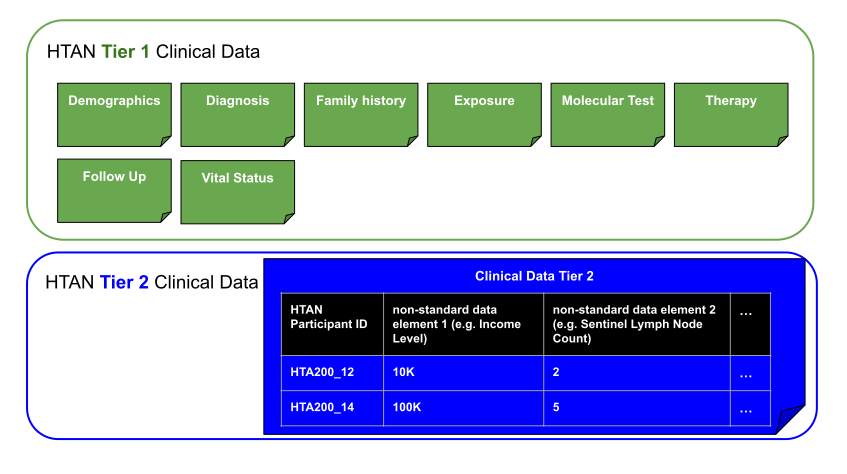
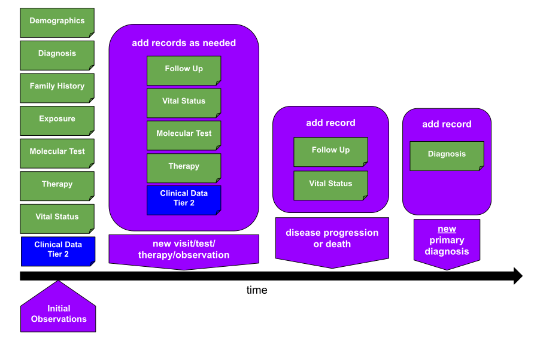

# Phase 2 Clinical Data Submission

## Overview
In HTAN Phase 2, there are two clinical metadata tiers. 
- Tier 1 metadata is divided into multiple categories, including Demographics, Diagnosis, Family History, Exposure, Molecular Test, Therapy, Follow Up and Vital Status. 
- Tier 2 contains any cancer or study-specific clinical information which is not represented in Tier 1. Tier 2 is a flexible comma-separated value (csv) file. The only required attribute is HTAN Participant ID. All other attributes (columns headers) are determined by the submitting Center. 

Figure 1 provides a general representation of the model. 

This page provides additional details regarding submission of Phase 2 Clinical Data. 

!!! Terminology:
This document uses the following terms from IEFT RFC 2119

MUST / REQUIRED / SHALL:  ✅ (denotes absolute requirement)

MUST NOT / SHALL NOT: ❌ (denotes absolute prohibition)

SHOULD / RECOMMENDED: 🌟 (denotes recommendation)

SHOULD NOT / NOT RECOMMENDED: 🙅‍♂️ (denotes not recommended)

MAY / OPTIONAL: 🤷‍♀️ (denotes optional) 
!!!

All HTAN data elements that capture time points are expressed as “Age in Days At” to obfuscate dates while allowing for longitudinal timelines and relative data analysis. For example, if a patient has therapy starting at X=365 days, that means the therapy started 365 days after birth. 

The data standards allow for multiple responses for many data elements.  This information may be found in the “Validation” column of the HTAN Data Model documentation. Multiple responses are submitted delimited by commas.

Data elements are aligned with the Standard Common Data Elements (CDEs) of the [NCI's caDSR](https://cadsr.cancer.gov/onedata/Home.jsp) where possible.

## Clinical Tier 1
### Demographics
Clinical Tier 1 Demographics data includes patient attributes captured at baseline or at the time of the cross-sectional observation. These data include ethnicity, race, etc.  
✅	A **single Demographics record** is REQUIRED for **each HTAN participant**.  
❌	A single HTAN participant MUST NOT have multiple demographics records.   

### Diagnosis
Clinical Tier 1 Diagnosis data elements describe the HTAN participant’s incident tumor or premalignant lesion (PML). These data include primary diagnosis, anatomic site of the tumor or PML, and classification and grade of the lesion. 
✅	A **single Diagnosis record** is REQUIRED **for each PML or tumor**. 
✅	All dates MUST be converted to days from index, where the index is the participant date of birth. (e.g. ‘Age in Days at Diagnosis’, ‘Age in Days at Last Known Disease Status’)  
✅	Data elements MUST use the permissible values established by the CRDC, including NCI Thesaurus ID for Primary Diagnosis and UBERON Codes for Tissue or Organ of Origin.  Please see the [HTAN Phase 2 Clinical Data RFC](https://docs.google.com/document/d/14gNmYTEmd5OjLUuut-w4ZTiF5qgxgpekImG3INM9vm8/edit?usp=sharing) for more information and links to the relevant caDSR codes.
🌟	If a participant develops a new lesion or has/had a secondary cancer, a new Diagnosis record (row) SHOULD be added to the Diagnosis manifest. In all other cases, each participant SHOULD have only one Diagnosis record.  

### Exposure
Clinical Tier 1 Exposure data elements describe the HTAN participant’s exposure to tobacco products, alcohol and other environmental exposure. These data include alcohol exposure, smoking history, years smoked, pack years smoked, and environmental exposure type. 
🌟	An Exposure record SHOULD be submitted to document the HTAN participant’s smoke or other exposure at baseline or at the time of observation in a cross-sectional study. 
🌟	A **single Exposure record** (row) SHOULD be submitted for **each participant**. 
🌟	Clinical Tier 2 SHOULD be used to submit additional exposure data consistent with a publication or other documentation, if needed. 

### Family History
Clinical Tier 1 Family History data elements capture the incidence of cancer in an HTAN participant’s family. 
🌟	A **single Family History record** (row) SHOULD be submitted for **each participant**. 
🌟	Clinical Tier 2 SHOULD be used to submit more extensive family history data, if needed. 

### Followup
Clinical Tier 1 Followup data elements capture a participant's status over time, including recurrence and progression (or their absence). 
🌟	A **single Followup record** (row) SHOULD be submitted for **each follow-up time point.** 
✅  All dates MUST be converted to days from index, where the index is the participant date of birth. (e.g. 'Age in Days at Followup', 'Age in Days at Progression or Recurrence') 

### Molecular Test
Clinical Tier 1 Molecular Test data elements capture descriptions of molecular tests completed clinically, in the diagnostic array, for an HTAN participant. It is intended to capture molecular data not represented in assay files, but important to a Center's study. Data elements include gene symbol, molecular analysis method, and copy number. 
🌟	A **single Molecular Test record** (row) SHOULD be submitted **for each molecular test being reported** for the HTAN participant. 
✅	All dates MUST be converted to days from index, where the index is the participant date of birth. (e.g. 'Age in Days to Molecular Test Start','Age in Days to Molecular Test Stop') 
🌟	For longitudinal follow-up, new molecular test annotations SHOULD be added as new records in the Molecular Test manifest. 

### Therapy
Clinical Tier 1 Therapy data elements capture descriptions of each cancer treatment administered for the HTAN participant. These data include the treatment type, treatment outcome, and the anatomic site of the treatment. 
🌟	A **single Therapy record** (row) SHOULD be submitted **for each treatment or treatment round** being reported for the HTAN participant.   
✅	All dates MUST be converted to days from index, where the index is the participant date of birth. (e.g. 'Age in Days at Treatment Start','Age in Days at Treatment Stop') 
🌟	For longitudinal follow-up, treatments administered since the last data was reported will be captured. New treatments SHOULD be recorded as new records in the Therapy manifest. 

### Vital Status
Clinical Tier 1 Vital Status data elements capture last known patient vital status and cause of death, when applicable. 
🌟	A **single Vital Status record** (row) SHOULD be submitted **for each known vital status/interaction** reported for the HTAN participant. In many cases there will be only one Vital Status record per participant. However, additional records can be added (to designate known survival time), up to and including participant death.   

## Clinical Tier 2
Tier 2 will contain any clinical observations not represented in the Tier 1 Clinical Data standard and must be represented as a Comma Separated Value (CSV) file. The only standardized field in the Tier 2 Clinical Data file will be HTAN Participant ID. All other data elements will be determined by the Center, in support of, for example, a publication.   These Tier 2 clinical data elements will be ingested directly into Synapse, and there will be no attempt at further standardizing any of these elements.  
✅	Each row in the Clinical Tier 2 csv file MUST contain a valid HTAN Participant ID in the first column.

## Specific Guidance Regarding Longitudinal Data
To support data re-use, HTAN expects all clinical and biospecimen related dates to be indexed to date of birth. For this reason, data elements are explicitly named "Age in Days...". The hope is that our end users will be able to compare participant timelines both within and between Centers. In order to do so, Centers need to be aligned in the way their Clinical Tier 1 and Biospecimen data are submitted. Figure 2 illustrates how different Clinical data would be submitted over time. Table 1 summarizes longitudinal clinical and biospecimen data requirements and timepoints. 

Minimally, all participants should have one Demographics, Diagnosis, Vital Status, Followup and originating (surgery or biopsy) Biospecimen record (row). At Baseline, Family History, Exposure, Molecular Test and Therapy records may also be submitted. Overtime, additional records can be added for Followup, Vital Status, Molecular Test, Therapy and derived[^1] or new originating Biospecimen. If a participant develops a *new* lesion or tumor, a new Diagnosis record may also be submitted for that participant describing the new lesion or tumor.

Table 1. Longitudinal Clinical and Biospecimen Data

| Timepoint | Metadata Category | Number of records per participant | Requirement | Anchoring time point |
|-----------|-------------------|-----------------------------|-----------|--------|
| Baseline | Demographics | 1 | Required | None |
| Baseline | Diagnosis | 1 per lesion/tumor being described | Required | AGE_IN_DAYS_AT_DIAGNOSIS |
| Baseline | Vital Status | 1 per observation | Required | AGE_IN_DAYS_AT_DIAGNOSIS |
| Baseline | Exposure | 1 | Optional | None |
| Baseline | Family History | 1 | Optional | None |
| Baseline | Molecular Test | 1 per molecular test | Optional | AGE_IN_DAYS_AT_MOLECULAR_TEST_START |
| Baseline | Therapy | 1 per therapy type administered | Optional | AGE_IN_DAYS_AT_TREATMENT_START |
|Surgery, Biopsy[^1] | Biospecimen | 1 record per biospecimen | Required | AGE_IN_DAYS_AT_SPECIMEN_COLLECTION |
| Scheduled Follow-up Timepoints | Followup | 1 per observation | Required | AGE_IN_DAYS_AT_FOLLOWUP |
| Scheduled Follow-up Timepoints | Vital Status |  1 per observation | Optional | AGE_IN_DAYS_AT_LAST_KNOWN_SURVIVAL_STATUS |
| Scheduled Follow-up Timepoints | Diagnosis | 1 per *new* lesion/tumor | Optional | AGE_IN_DAYS_AT_DIAGNOSIS |
| Scheduled Follow-up Timepoints | Molecular Test | 1 per *new* molecular test | Optional | AGE_IN_DAYS_AT_MOLECULAR_TEST_START |
| Scheduled Follow-up Timepoints | Therapy | 1 per *new* therapy type administered | Optional | AGE_IN_DAYS_AT_TREATMENT_START |
| Unscheduled Follow-up Timepoints | Vital Status |  1 per observation | Optional | AGE_IN_DAYS_AT_LAST_KNOWN_SURVIVAL_STATUS |
| Unscheduled Follow-up Timepoints | Molecular Test | 1 per *new* molecular test | Optional | AGE_IN_DAYS_AT_MOLECULAR_TEST_START |

[^1]: Derived specimen (e.g. sections made for imaging or other assays) are also recorded in the biospecimen metadata. These are connected to the originating biospecimen via 'HTAN Parent ID'.

