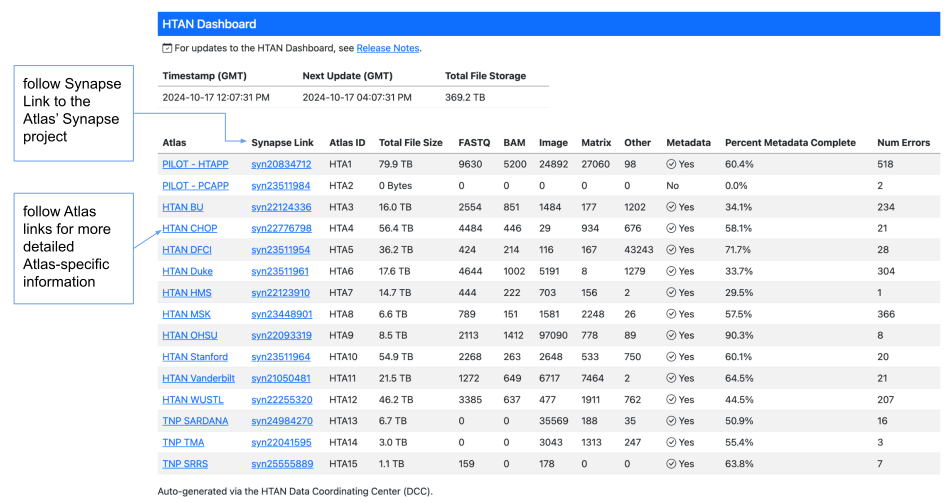
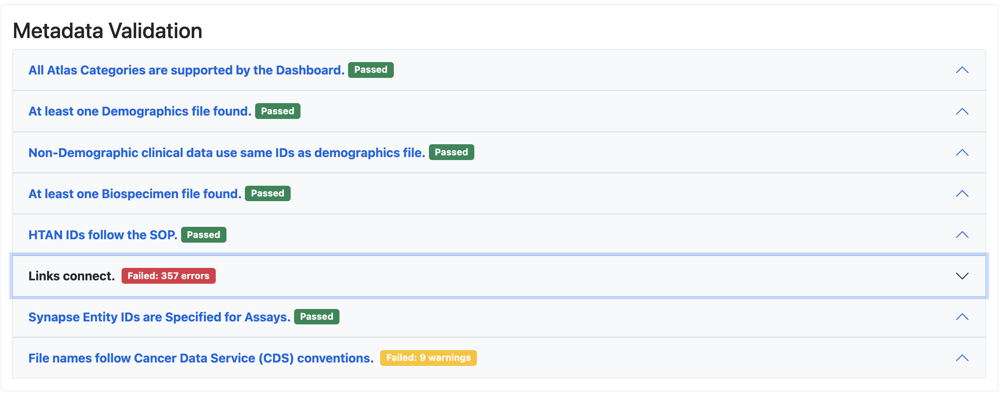
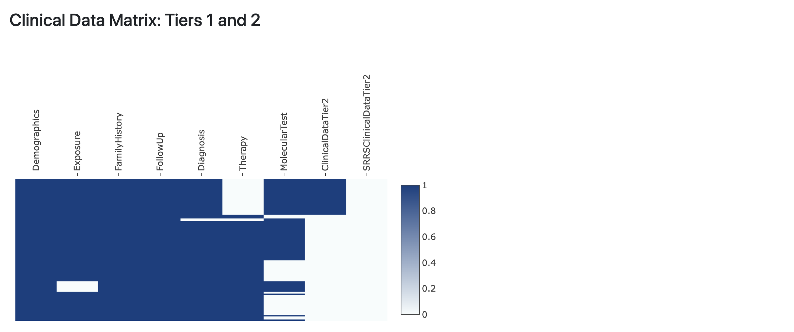
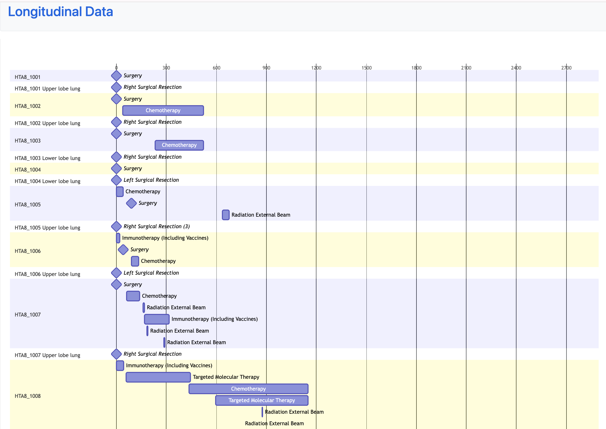

# HTAN Dashboard

The HTAN Data Coordinating Center (DCC) hosts the [HTAN Dashboard](https://hdash.website-us-east-1.linodeobjects.com/) to help centers track submitted data, data completeness and data submission errors.

The main page of the dashboard provides an overview of submitted assay and metadata as well as total number of submission errors. The Atlas links on the main page provide additional details for each Atlas. The Synapse project links will take you directly to the Atlas' project in Synapse if you have Synapse access to the project.

On the Atlas-specific pages, there are several tables and visuals to help you assess the type of data available and any metadata validation errors. Examples include an expandable metadata validaton errors table, metadata submission matrices and a summary of available longitudinal data. Please see the figures below for examples.

