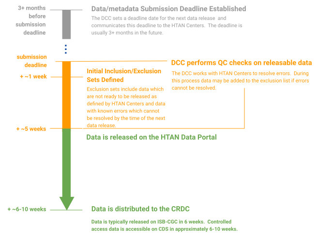

# Data Release

!!! Specific Data Submission and Release Timelines
A calendar with specific dates and release timelines for HTAN Phase2 is available for HTAN Centers in the [HTAN2 Synapse Wiki](https://www.synapse.org/Synapse:syn63296487/wiki/640549). The HTAN DCC will update the calendar with new dates as they are established.

:warning: access to the Synapse Wiki is restricted to HTAN Members and Synapse login is required. If you have issues accessing the calendar, please contact your [data liaison](Data_Liaisons.md)
!!!

The Data Coordinating Center (DCC) prepares major data releases every 4-6 months. HTAN Centers are notified of the data submission deadline for an upcoming data release. After that deadline, the pre-release process involves a number of data processing and metadata verification steps. Data is released via the HTAN Data Portal, and then disseminated to various Cancer Data Research Commons (CRDC) nodes including Cancer Data Service (CDS) and the Institute for Systems Biology Cancer Gateway in the Cloud (ISB-CGC) to enable download of controlled-access data and long-term cloud access

