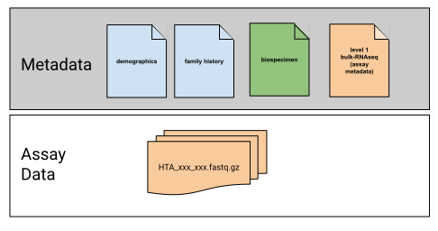

# What is Metadata?

Metadata means data *about* data.  Metadata enables both data searchability and interpretability. For HTAN, this includes sample and case identifiers, patient information (e.g. demographics), biospecimen information (e.g. tumor type), and assay-specific information (e.g. experiment protocol, assay reagents or assay technology). 

HTAN's [Data Model](../data_model/overview.md) is a framework for collecting and storing metadata.  The Data Model in turn supports effective searching for data on [HTAN's Data Portal](https://humantumoratlas.org/explore).

Metadata is submitted to HTAN via the Synapse Data Curator App [(DCA)](https://dca.app.sagebionetworks.org/), developed and maintained by [Sage Bionetworks](https://sagebionetworks.org/).  The DCA performs several automated validation checks to make sure the metadata complies with the HTAN Data Model.  Please see [Submitting Assay Data and Metadata](../data_submission/clin_biospec_assay.md) for more information about the DCA.

!!! Terminology Alert
The term "manifests" refers to the spreadsheets used to submit metadata.  "Metadata templates" are available via the DCA.  These are manifests which can be filled out, validated and submitted using the DCA's web interface.  
!!!