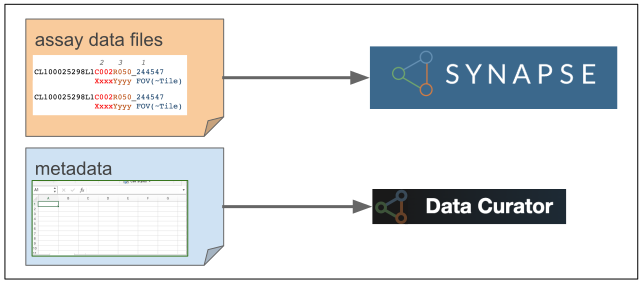

# Data Submission Overview
Only HTAN Centers and Associate Members can submit data to the HTAN Network's repositories. The Data Submission Section of this Manual is intended as a guide for HTAN Centers and Associate Members.

:exclamation: *Prior to submitting data, all data must be de-identified.  Please see [Data De-identification](../data_pub_submission/Data_Deidentification.md) for more information.*

Data Submission involves two key steps:
1. Uploading assay data files to Synapse; and
2. Completing and validating manifests using the Data Curator App (DCA).

Specific details regarding data submission and the DCA are included in later sections of this manual.  Please contact your [Data Liaison](../data_pub_submission/Data_Liaisons.md) if you have any questions or issues.  Please also keep your data liaison informed of any data submissions.

The current status of data uploads (refreshed every 4 hours) is available on the [HTAN Dashboard](http://hdash.website-us-east-1.linodeobjects.com/index.html).