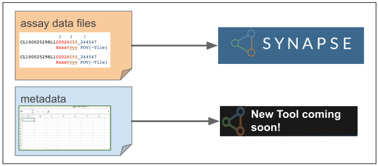

# Introduction
Only HTAN Centers and Associate Members can submit data to HTAN repositories. The Data Submission Section of this Manual is intended as a guide for HTAN Centers and Associate Members.

:exclamation: *Prior to submitting data, all data must be de-identified.  Please see [Data De-identification](../data_submission/Data_Deidentification.md) for more information.*

## Phase 2 Data and Metadata Submission
In HTAN Phase 2, data and metadata submission are centralized within the Synapse platform which is developed and maintained by <a href="https://sagebionetworks.org/" target="_blank" rel="noopener noreferrer">Sage Bionetworks</a>. 

Assay Data Submission involves uploading the data files and then annotating those files with required metadata. (Figure 1) Additional metadata for the Clinical and Biospecimen modules of the HTAN2 Data Model are submitted via Synapse as **Record-based** metadata. (Figure 2)

Specific details regarding data submission may vary by data type. Please take a look at later sections of this manual and contact your  [Data Liaison](../data_submission/Data_Liaisons.md) if you have any questions or issues.  Please also keep your data liaison informed of any expected data submissions.

!!! :zap: Helpful Links :zap:
The [Data Model section](../data_model/overview.md) of this manual provides an overview of how data should be structured, metadata and file requirements and links to other data model documentation.

[HTAN Checklist for Acceptance of Data](checklist.md) reviews parts of the Human Tumor Atlas Network DMSA  (Internal Data and Materials Sharing Agreement) <a href="https://drive.google.com/file/d/186TMLs3L2dKrXvMQLGuEYC-7jyGHCRw3/view?usp=sharing/" target="_blank" rel="noopener noreferrer">(HTAN DMSA)</a> which are relevant to data submission.

The [Submitting Assay Data and Metadata](clin_biospec_assay.md) page provides a quick overview of data and metadata submission, including pre-submission steps such as becoming a Certified Synapse User.

The <a href="https://www.synapse.org/Synapse:syn63296487/wiki/629655" target="_blank" rel="noopener noreferrer">Phase 2 HTAN Wiki</a> on Synapse provides internal resources including "How Do I...?" and "Where Do I Find...?" pages. If you need to onboard new personnel or have other HTAN-specific questions not answered in this manual, you may find the information you need on the wiki. If you are an HTAN Member and cannot access the wiki, please contact your data liaison.

If you have any issues or questions regarding HTAN data submission, please submit a ticket to the <a href="https://sagebionetworks.jira.com/servicedesk/customer/portal/1" target="_blank" rel="noopener noreferrer">HTAN Help Desk</a>
!!!
