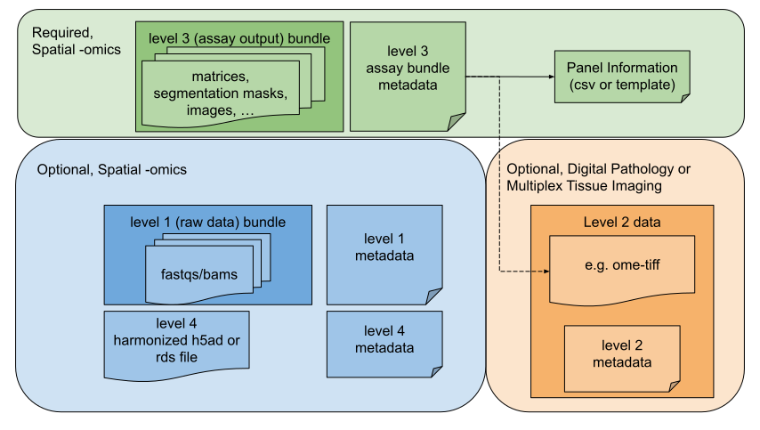

# Phase 2 SpatialOmics

+++ Overview
# Overview

SpatialOmics is defined as spatially resolved sequencing and sequence-hybridization based omics technologies which molecular profiling of tissues while preserving spatial context. Please see [covered assays](#covered-assays) and [out of scope](#out-of-scopecovered-in-a-separate-standard) for specific assays covered by the SpatialOmics standard.

Metadata requirements are documented in the HTAN Data Model <a href="https://htan2-data-model.readthedocs.io/en/main/" target="_blank" rel="noopener noreferrer">readthedocs</a> pages. This part of the manual describes **file requirements** for SpatialOmics data.

## Covered Assays
**Spot-based capture assays** \
These methods capture transcripts via physical arrayed spots or beads with spatial barcodes: 
* 10x Genomics Visium and Visium HD
* Slide-seq and related variants

**In situ sequencing (ISS) and hybridization-based assays** \
These assays directly read transcript identity and location in fixed tissue using fluorescent in situ sequencing or barcoded probes: 
* seqFISH and seqFISH+
* MERFISH
* Academic ISS methods

**Barcoded capture with molecular decoding (molecular barcoding + NGS)** \
These platforms use transcript capture followed by NGS-based decoding, often with multiplexed probe panels and image-based segmentation: 
* 10x Genomics Xenium
* Nanostring CosMx SMI
* BGI/MGI STOmics platforms:
    * Stereo-seq (RNA)
    * Stereo-CITE (RNA + protein)
    * Stereo-seq OMNI (multiome)

**Other sequencing-based spatial molecular profiling** \
This includes assays that capture spatially resolved: 
* Epigenetic features (e.g., spatial ATAC-seq)
* Multi-omic profiles (e.g., transcriptome + proteome)
* Spot-based capture assays

## Out of Scope/Covered in a separate standard

**Non-spatial transcriptomics** \
Bulk RNA-seq
Single-cell RNA-seq (scRNA-seq)

**Mass spectrometry-based imaging and spatial proteomics**\
Covered in a separate spatial proteomics RFC

**Multiplexed protein-based spatial imaging**\
Including CyCIF, CODEX, and MIBI
Covered in the Imaging RFC

**Non-multiplexed digital pathology**\
Including diagnostic H&E imaging and conventional histopathology slides
Covered in the Digital Pathology RFC

+++ Data Levels

Please see the "Required Files" and "Optional Files" tabs for more information.

| Level | Requirement | Data Type | Example Files |
|---|-------------------|----------------------|
| 1 | optional | bundle of Raw data (FASTQs) | .tar, tar.gz, .zip |
| 3 | required | Processed assay output bundle with accompanying panel information table, if applicable. :warning: NO CONTROLLED ACCESS DATA. | .tar, tar.gz, .zip |
| 4 | optional | Harmonized output file (e.g., AnnData or seurat compatible RDS) included to support downstream analysis| h5ad, RDS |

H&E or multiplex immunofluorescence (MIF) image metadata is captured in separate digital pathology or multiplex tissue imaging templates. These may be connected via attributes in the SpatialOmics metadata or they can be linked through shared biospecimen IDs.

+++ Required Files
## Required Components
For each spatial assay, contributors must provide the following:

**Processed assay output bundle (Level 3)**
* A compressed archive (e.g., .tar.gz, .zip) containing platform-specific output files. Please see [Example Level 3 bundles](#example-level-3-bundles).
* Must follow the expected directory and file structure defined in HTAN platform guidance.
* :warning: May NOT contain controlled-access data such as fastqs or bams.
* Should include segmentation outputs, raw or normalized matrices, and any relevant vendor JSONs, manifest files, or images.
* For assays that include registration transforms or same-section imaging, these must be bundled or clearly referenced.

**Bundle-level metadata**
* One row per assay bundle in the spatial metadata table (submitted as .tsv or via Synapse Table).
* Captures key information such as assay platform, kit version, QC metrics, and registration to upstream biospecimen.

Please see the HTAN Data Model <a href="https://htan2-data-model.readthedocs.io/en/main/" target="_blank" rel="noopener noreferrer">readthedocs</a> pages for specific metadata attributes and requirements.

**Panel information (if applicable)**
* If the assay uses a targeted sequencing or protein panel, a reference to a Synapse-hosted panel information table must be included.
* Sequencing and protein panels should be submitted as separate tables or filtered by Target_Type.
* Applies to assays like Xenium, CosMx, and Stereo-CITE.

### Example Level 3 bundles
If you do not see your platform in the examples below and need more information, please contact your data liaison.

**10x Genomics Visium / Visium HD** \
Typical output:
* filtered_feature_bc_matrix.h5
* spatial/tissue_positions_list.csv
* spatial/scalefactors_json.json
* spatial/tissue_lowres_image.png (or highres, if used)
* analysis/clustering/gene_expression_graphclust/clusters.csv
* metrics_summary.csv
* Optional: molecule_info.h5
* Optional: Binned outputs for Visium HD (e.g., bin_2um/, bin_8um/ folders)
* Prohibited: .fastq, .bam and .bai files. If these are in your output folder, you must remove them.

**Nanostring CosMx SMI** \
Typical output:
* cell_by_gene.csv (expression matrix)
* cell_metadata.csv
* gene_metadata.csv
* segmentation_mask.ome.tiff or equivalent
* full_resolution_image.ome.tiff
* cell_boundaries.json or .csv
* pipeline_metadata.json
* Optional: FOV summary statistics

**10x Genomics Xenium** \
Typical output:
* analysis/transcripts.parquet
* analysis/cells.parquet
* analysis/images/ (HE or DAPI TIFFs)
* analysis/segmentation.zarr
* analysis/analysis.json
* metadata.json
* Optional: panel.json
* Optional: spatial/ subfolder for image registration assets

**seqFISH** \
Typical output:
* Counts_raw.csv
* coordinates.csv
* seqFISH_metadata.csv
* DAPI experiment folder (ome.tiff files)
* ROI experiment folder (ome.tiff files)
* point locations.mat
* all_gene_Names.mat

+++ Optional Files
## Optional or Situational Components

**Level 1 data – bundle of Raw data (FASTQs)**
* Not required and contents not standardized.
* Minimal metadata attributes describing contents to enable reuse.

**Level 4 data – Interoperable h5ad or rds files**
* If available, a harmonized output file (e.g., AnnData or seurat compatible RDS) may be included to support downstream analysis.
* Should follow standard and structure conventions (to be separately defined).
* Includes spatial coordinates, feature metadata, and expression matrices in a reusable format.

**High resolution Imaging metadata**
* H&E or multiplex immunofluorescence (MIF) image metadata is captured in separate digital pathology or multiplex tissue imaging templates.
* The SpatialOmics level3 metadata provides a pointer mechanism to connect those templates, although this is also possible through shared biospecimen IDs.

