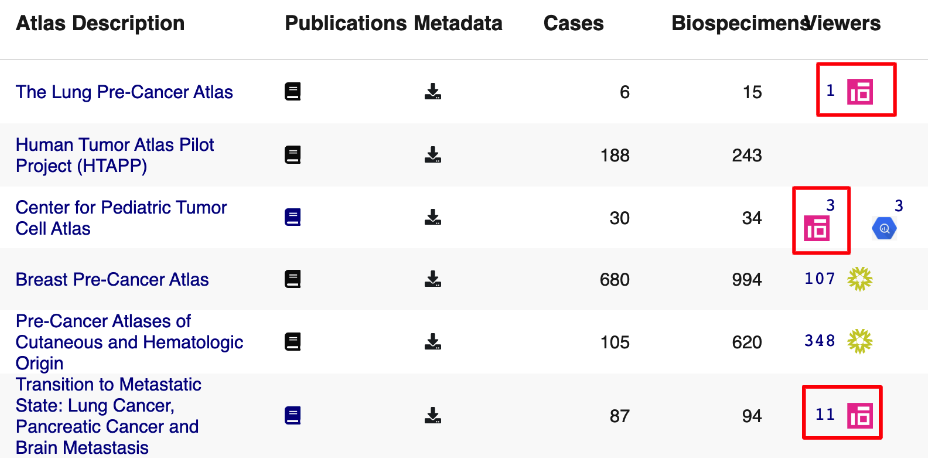
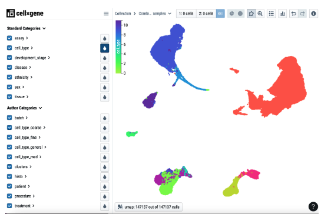

# Visualizing Single Cell Data via CellxGene

Through our collaboration with the [Chan Zuckerberg Initiative (CZI)](https://chanzuckerberg.com/), we make HTAN single cell RNA seq data available via [CellxGene](https://cellxgene.cziscience.com/). CellxGene enables you to visualize and explore large-scale single cell data sets. For complete details on CellxGene, please refer to the [online documentation](https://cellxgene.cziscience.com/docs/01__CellxGene).

HTAN data sets with CellxGene visualization are denoted on the main home page in the rightmost column. Clicking the CellxGene logo will take you directly to CellxGene.

Example HTAN data from MSKCC, as visualized in CellxGene is shown below:

