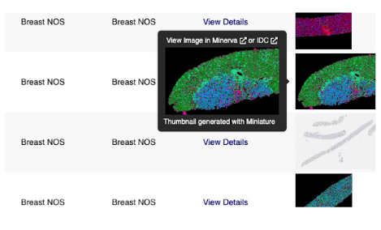
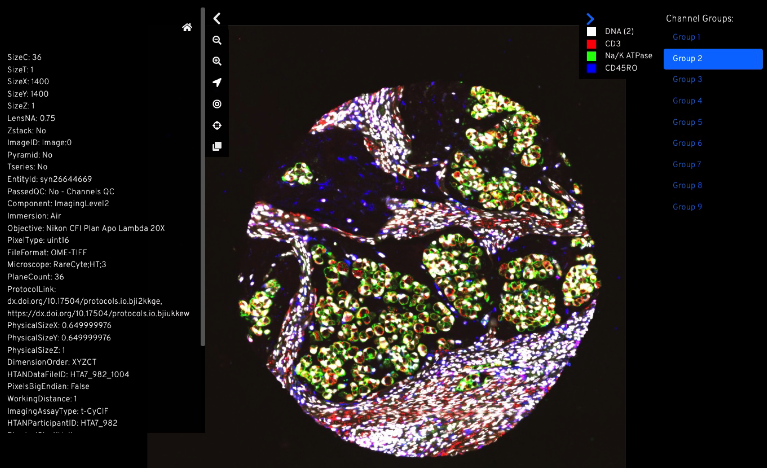
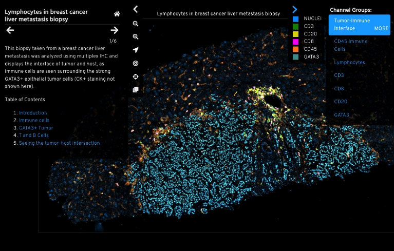

# Visualizing Multiplex Imaging Data via Minerva

Through our collaboration with the Laboratory of Systems Pharmacology (LSP) at Harvard Medical School, many HTAN images can be visualized via [Minerva](https://github.com/labsyspharm/minerva-story/wiki), a web-based tool that enables interactive viewing and fast sharing of large image data.

Where a Minerva story is available on the HTAN Data Portal, a link will be visible when hovering over the thumbnail image in the **View** Column.

For most images, a basic Minerva story has been prepared using [Auto Minerva](https://github.com/jmuhlich/auto-minerva), a tool to prepare default Minerva stories with optimized channel thresholds. An example prepared with Auto Minerva is shown below.

The image can be zoomed and panned with the mouse. Channel groups can be selected using the bar on the right. Selected metadata is shown in the left panel and can be collapsed. Point, box and polygon annotations can be generated and shared as a URL.

For some images, centers have provided custom Minerva stories leveraging features such as waypoints, annotations, data overlays and narrative text. An example custom Minerva story is shown below.

