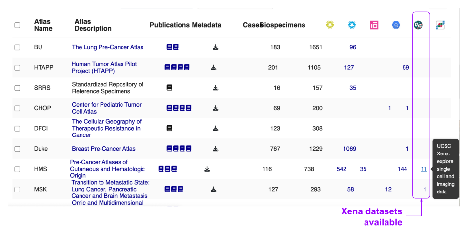

# Visualizing Data via Xena

<a href="https://xena.ucsc.edu/" target="_blank" rel="noopener noreferrer">Xena</a> is a platform developed by the University of California Santa Cruz Genomics Institute to support visualization and analysis of multiomics data. Please see their <a href="https://ucsc-xena.gitbook.io/project/tutorials" target="_blank" rel="noopener noreferrer">tutorial pages</a> for more information regarding the type of analyses possible in Xena.

A subset of HTAN single cell/single nuclei RNA-sequencing and t-CYCIF data has been submitted to Xena. These datasets can be found on Xena either by accessing them through the HTAN Portal or searching for "HTAN" on Xena.

