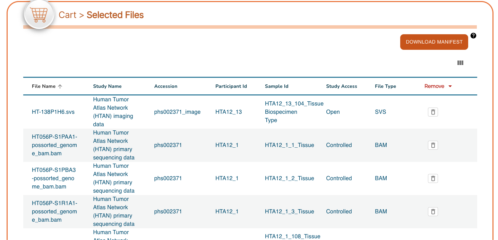

# Accessing Images via SB-CGC Cancer Data Service (CDS)

HTAN Imaging Level 2 data is now available through the [NCI SB-CGC Cancer Data Service (CDS)](https://datacommons.cancer.gov/repository/cancer-data-service).

Data access via Seven Bridges Cancer Genomics Cloud (SB-CGC) requires a CGC account [[register here](https://docs.cancergenomicscloud.org/docs/sign-up-for-the-cgc)]. For further information on using SB-CGC resources including programmatic access options, you can explore their [online documentation](https://docs.cancergenomicscloud.org/docs).

# DRS Manifest Files

To access data via CDS, first generate a CDS Data Repository Service (DRS) manifest containing the files you would like to obtain. DRS manifests are CSV files and require at minimum the **name** and **drs_uri** of each file of interest. For HTAN data, DRS manifests can be generated in one of three ways: 

1. CDS Portal
2. HTAN Data Portal
3. Google BigQuery

## 1. Generating a Manifest File from the CDS Portal

In order to access HTAN imaging data within the [CDS Portal](https://dataservice.datacommons.cancer.gov/), navigate to the portal in a web browser and click on the **Explore CDS Data** button on the landing page.

&nbsp;

On the Data Explorer page, expand the STUDY section on the left sidebar, scroll down, and check the box next to **Human Tumor Atlas (HTAN) imaging data**.

This action will change the summary panel to reflect selecting HTAN data only.

Scroll down, or click on the **Collapse View** tab on the upper right just below the query summary line in order to see the tabulated view of all of the participants, samples or files in HTAN.

Click on the **Add All Files** button, or select the check boxes next to all Participants, Samples or Files for a subselection and then click on the **Add Selected** button.  This action will update your cart icon in the upper right corner.

Clicking on the cart icon, will bring up a list of the selected files.  Click on the **Download Manifest** button in the upper right to download a CSV-formated (Excel compatible) file of this file list.

## 2. Generating a Manifest File from the HTAN Data Portal

From the [HTAN Data Portal](https://humantumoratlas.org/), click **CDS/SB-CGC (Open Access)** under the **Data Access** filter. 

Navigate to the **Files** tab, check the box next to **Filename** in upper left, and then click **Download selected files**. 

Click **Download Manifest**, which will download a local file called `cds_manifest.csv`. 

## 3. Generating a Manifest File from Google BigQuery
HTAN metadata and a mapping of HTAN Data File IDs to CDS DRS URIs are available as Google BigQuery tables via the Institute for Systems Biology Cancer Gateway in the Cloud (ISB-CGC) (see [Google BigQuery](https://docs.humantumoratlas.org/open_access/biq_query/)). These tables can be used to subset data to a cohort of interest, and obtain DRS URIs of files to access. 

For a step-by-step guide on how to generate a DRS manifest file using Google BigQuery, please see the Python notebook [Creating_CDS_Data_Import_Manifests_Using_BQ.ipynb](https://github.com/isb-cgc/Community-Notebooks/blob/master/HTAN/Python%20Notebooks/Creating_CDS_Data_Import_Manifests_Using_BQ.ipynb).

# Accessing Data
Once you have your manifest, follow the instructions on SB-CGC's [Import from a DRS server](https://docs.cancergenomicscloud.org/docs/import-from-a-drs-server#import-from-a-manifest-file) documentation page to import data from a manifest file.