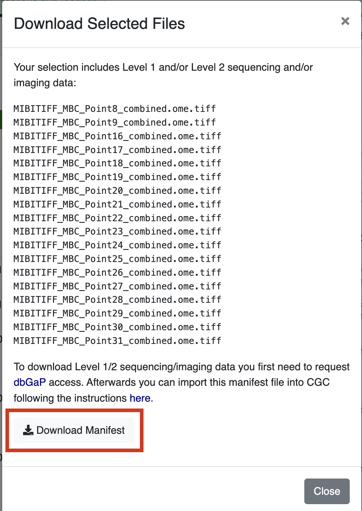
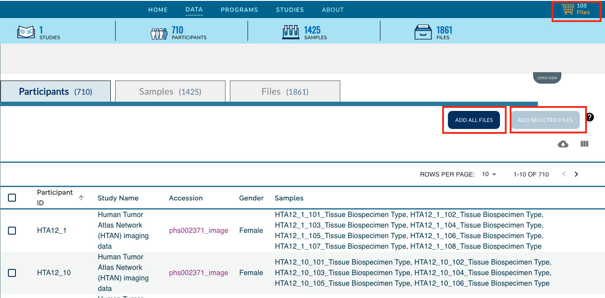

# Accessing Images via SB-CGC Cancer Data Service (CDS)

HTAN Imaging Level 2 data is now available through the [NCI Cancer Data Service (CDS)](https://datacommons.cancer.gov/repository/cancer-data-service).

Data access via Seven Bridges Cancer Genomics Cloud (SB-CGC) requires a CGC account [[register here](https://docs.cancergenomicscloud.org/docs/sign-up-for-the-cgc)]. For further information on using SB-CGC resources including programmatic access options, you can explore their [online documentation](https://docs.cancergenomicscloud.org/docs).

## Filtering for HTAN Images in the CDS File Repository

From the [SB-CGC dashboard](https://cgc.sbgenomics.com/home/), click **Cancer Data Service Explorer** under the **Data** tab. 

Select **Explore files**

From the sidebar, filter by **Dataset**: HTAN and **Experimental Strategy**: ImagingLevel2

 

This provides a listing of all HTAN Imaging Level 2 data that is currently available through CDS. 

## Download Images from CDS

Additional filters are available for further selection including Data format, Site, etc., as well as text search fields to search files by Filename, case ID (HTAN Participant ID), and sample ID (HTAN Biospecimen ID).

Once you have filtered to your files of interest, click **Copy to project** to add the selected files to the SB-CGC project of your choosing (create a new project if you do not have one set up). 

You will be automatically re-directed to the **Files** tab of your SB-CGC project. From here, check the boxes of the files you would like to save. Clicking **Download** will download the selected images to your local machine.

