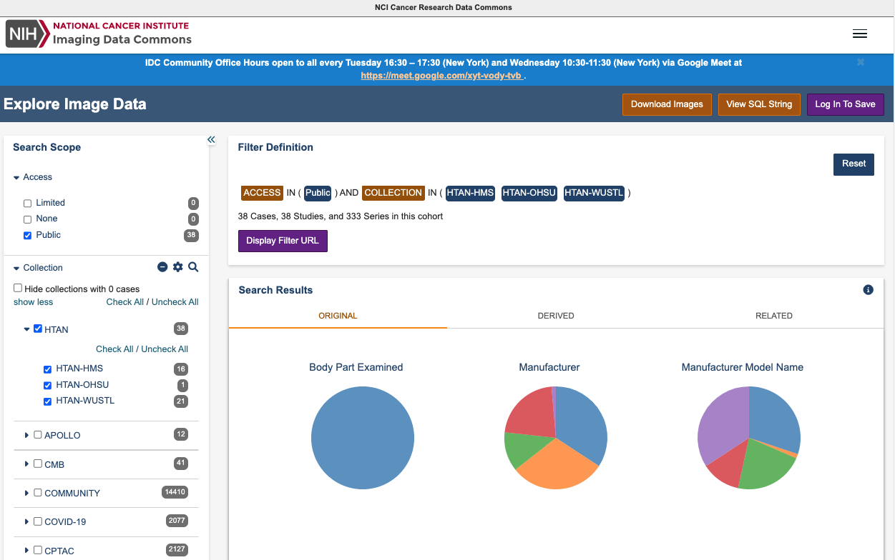
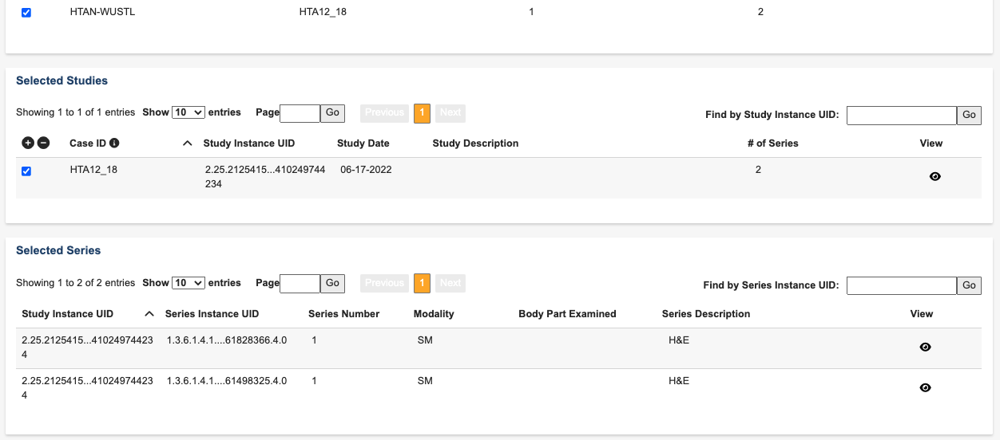
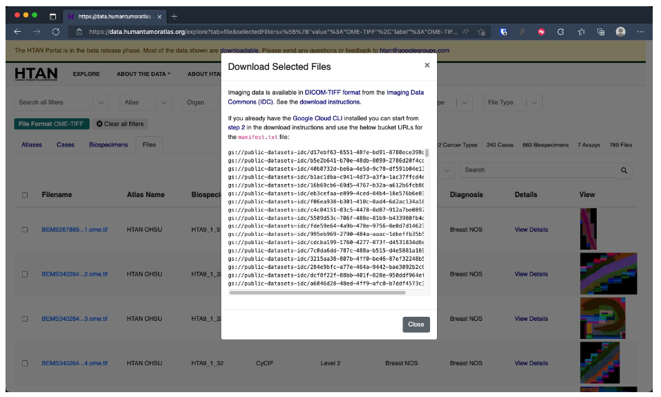
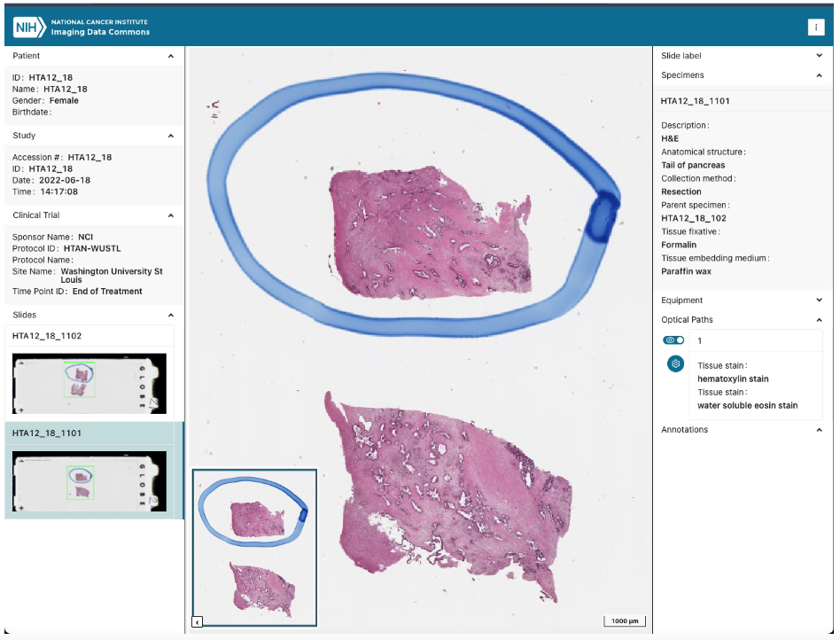

# Accessing Images via Image Data Commons (IDC)

HTAN Imaging Level 2 data is now available through the [NCI Imaging Data Commons (IDC)](https://portal.imaging.datacommons.cancer.gov/).

Imaging Data Commons hosts versions of the HTAN Imaging Level 2 data converted to [DICOM-TIFF dual personality files](https://learn.canceridc.dev/dicom/dicom-tiff-dual-personality-files). For further information and an example open source implementation, see [online reference](https://www.sciencedirect.com/science/article/pii/S2153353922003753#!).

For further information on using the IDC, you can explore their [online documentation](https://learn.canceridc.dev/).

## Filtering for HTAN Images in the IDC portal

From the [homepage of the Imaging Data Commons](https://portal.imaging.datacommons.cancer.gov/), click the purple **Explore** link to explore image data.

HTAN data can be selected by selecting in the **Collection** group in the left-hand bar (you may need to click "show more" to reveal all collections).

Pie charts show the breakdown of selected metadata attributes.

By checking collections (e.g. HTAN WUSTL), cases (participants), studies (biospecimens), and series (images), the study instances of selected images may be found.

## Download Images from IDC

HTAN data is shared under a CC-BY 4.0 license, and is available to download as DICOM images without egress costs from IDC thanks to support from the Google public datasets program. For complete details, see [IDC Documentation on Downloading Data](https://learn.canceridc.dev/data/downloading-data). Basic download instructions are also included on the HTAN portal for files released by the IDC, by selecting the filename.

Note that individual DICOM files representing each channel and pyramid level may need to be sorted or converted back to TIFF files for reuse in image analysis tools.

## Viewing Images via the IDC SLIM Viewer

Clicking they **eye icon** in the view column on the IDC portal, or the **IDC** link when hovering over the thumbnail in the HTAN portal, takes the user to IDC’s interactive SLIM viewer. This interactive viewer provides image exploration and pre-rendered scenes.

