# Using the HTAN Data Portal

The **HTAN Data Portal provides access to all open access HTAN data**. To get started, go to: https://data.humantumoratlas.org/explore.

To orient you to the HTAN Data Portal, consider the example of accessing precancerous polyp data from Vanderbilt University, as described in their recent [Cell publication](https://pubmed.ncbi.nlm.nih.gov/34910928/).

By default, HTAN data is organized by research center:

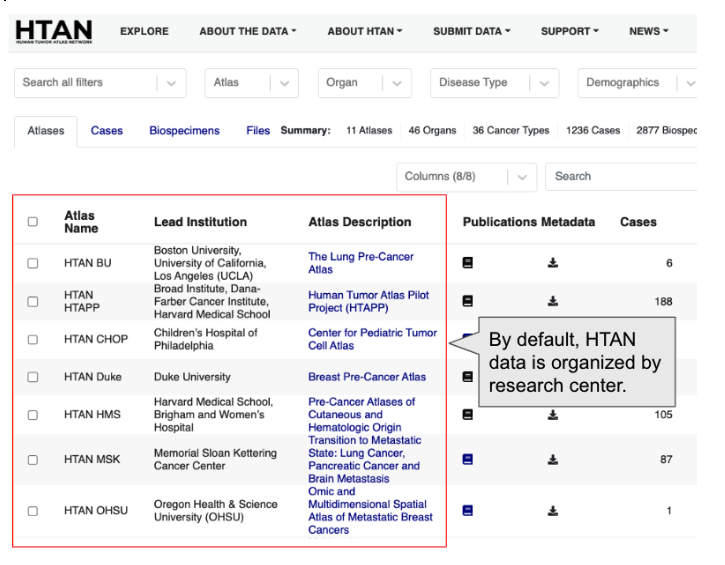

If you scroll down on the page, you will see Vanderbilt University:

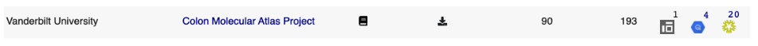

As of this writing, you can see that the Vanderbilt Colon Atlas project has 90 cases and 193 biospecimens.

## Downloading Metadata

Once you have identified the project of interest, you can click the download metadata button:

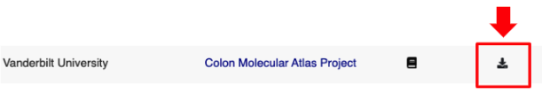

You will then be prompted with a dialog box of all metadata associated with the specified project. For example:

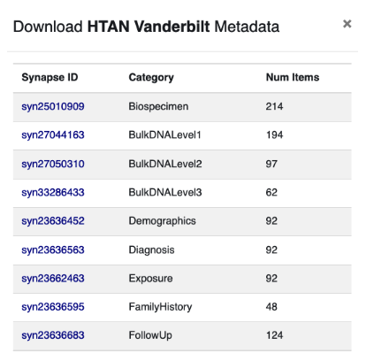

Behind the scenes, HTAN leverages the [Synapse Platform](https://www.synapse.org/) created and maintained by [Sage Bionetworks](https://sagebionetworks.org/). Each piece of HTAN data is automatically assigned a unique Synapse identifier, such as syn25010909. In the screenshot above, you can see that the Vanderbilt project has multiple metadata files, each associated with a unique Synapse identifier.

If you click on any of the Synapse links above, you can immediately download a comma separated value (CSV) file associated with the metadata category. There is no need to create a Synapse account or log into Synapse. For example, here we have download the Vanderbilt biospecimen file and loaded it into Excel:

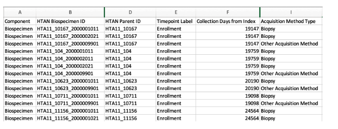

Once you have downloaded metadata files, you can parse them in your favorite programming language, such as R or Python. To understand the individual columns within each metadata file, please refer to the [HTAN Data Model](../../data_model/overview).

## Exploring Available Data

The HTAN Data Portal provides a unified interface for filtering and exploring HTAN data sets. Each filter is available at the top of the page:

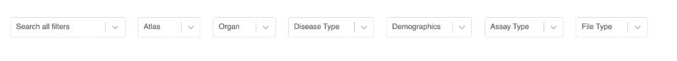

To get started, you can click the Atlas pull-down menu, and select the Vanderbilt HTAN center:

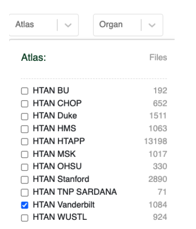

Your selection will now be reflected in the user interface:

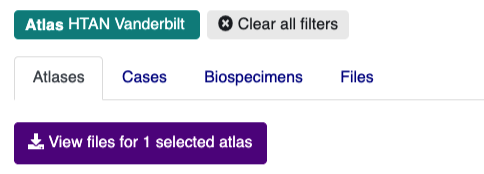

If you click the **Cases** or **Biospecimens** tabs, you can browse available metadata. Clicking the **Files** tab will take you to an interactive table listing all files available for download.

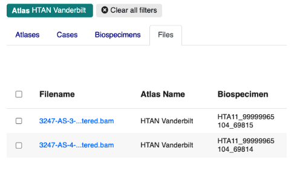

At this point, the Files tab is likely to contain hundreds of files, and may be difficult to navigate. You can further refine the files table by clicking on the **Assay Type** or **File Type** filters. This will trigger pop-up windows that describe the assay and file type categories available within the Vanderbilt project. For example, if you click Assay Type you will see:

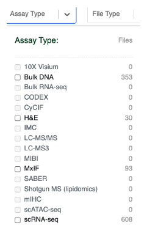

Data that is available within the Vanderbilt project is set to **bold**. You can therefore see that the Vanderbilt project has Bulk DNA, H&E Images, Multiplex ImmunoFluorescence images and Single Cell RNA Seq Data.

If you click scRNA-seq, the file table will automatically update. You can then select the **File Type** filter to drill-down even further:

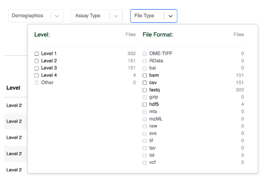

Clicking Level 4 here will now filter the File table to only include Level 4 sequencing data that consists of Single Cell RNA Seq h5ad formatted files:

Note that you can remove any existing filters by clicking on any of the “chips” in the page header. For example, if you want to remove the Level 4 filter, just click the Level 4 chip:

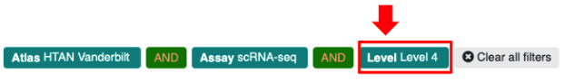

Clicking **View Details** on any of these files will pop open a metadata table. For example:

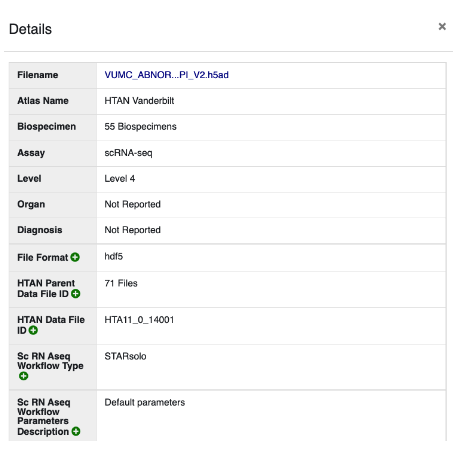

## Downloading Open Access Data

Once you have specified your filter criteria, the Files tab will display all matching files. At this point, you may see two types of files:

-   Open Access Files; and
-   Access Controlled Files

!!! Synapse Account Required
To download open access files, you will need to first create a free account on the Synapse data platform. To register an account, goto https://www.synapse.org/, and click the Register button.
!!!

Once registered and logged into Synapse, you can then click through from the HTAN Data Portal to the corresponding page on Synapse. For example, this CSV file corresponds to single cell data generated by the Vanderbilt project:

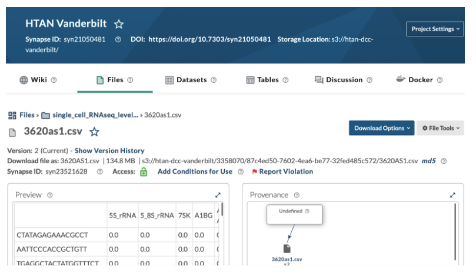

You can click the **Download Options** button to download the file. To retrieve the same file via R, Python or via the command line, click the Download Options button and select **Programmatic Options**.

To download access-controlled files, please refer to [Access Controlled Data Access](../access_controlled/db_gap.md).
